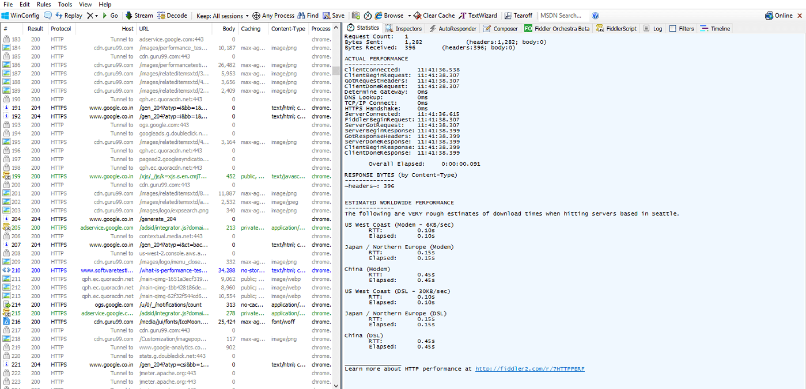
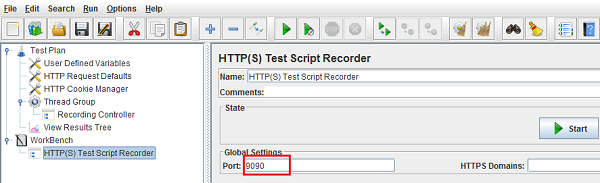
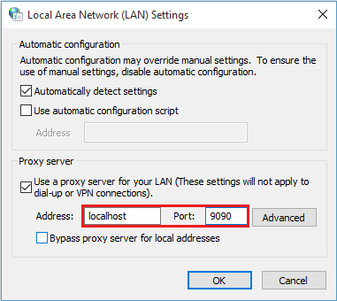
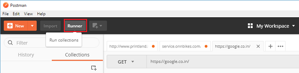
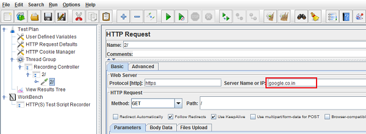
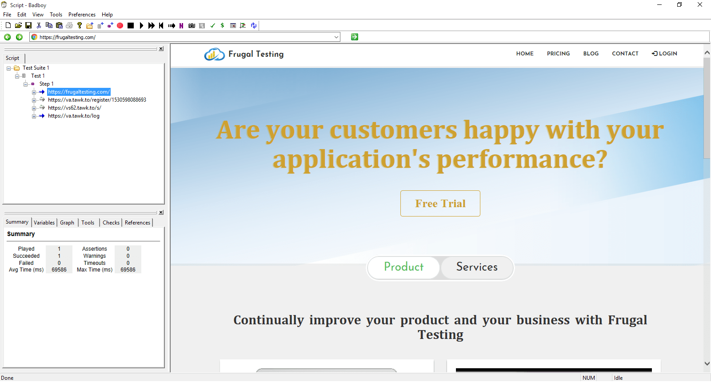
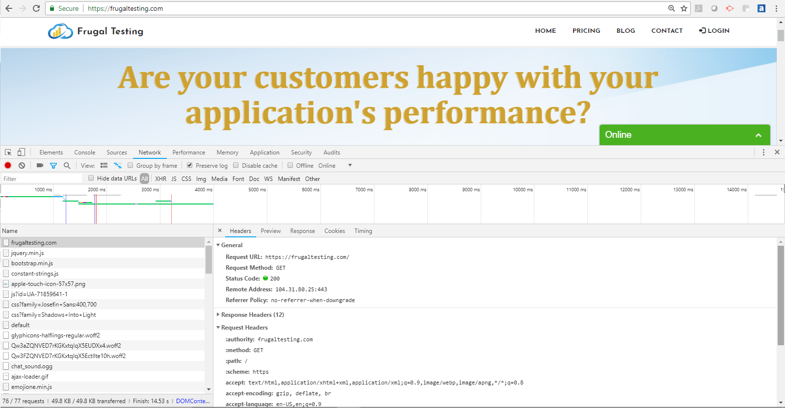
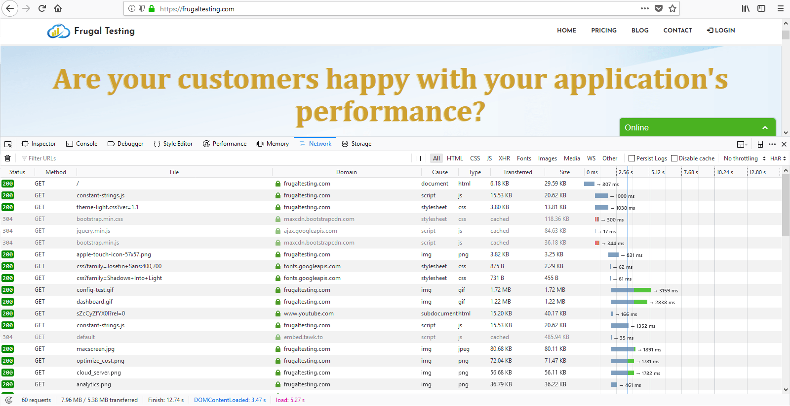

Here are some great tools which are beneficial for a JMeter tester for debugging the requests:

<h4 class="blog-subtitle">FIDDLER:</h4>

Fiddler helps to capture the HTTP(S) traffic and debug the requests and to analyse web session caching, cookie and header properties in detail in Inspector tab. We can get network stats of the requests using Statistics tab.
Composer to execute the requests and Timeline allows you to visualize the traffic on a 'waterfall' diagram.

We can also capture the mobile traffic by setting the proxy in mobile device.

To get Fiddler:<a target="blank" href="https://www.telerik.com/fiddler"> Click Here</a>

<h4 class="blog-subtitle">POSTMAN:</h4>

Postman is a tool chain for API developers to share, test, document and monitor APIs.
This helps the users to check or debug HTTP/HTTPS request along with their response data.

We can save the entire requests under collection. Also we can export the collection to JMeter by setting up the proxy in JMeter and running the collection in Postman.
Open JMeter, add HTTP Test Script Recorder to the Test Plan and enter port number and Start the Recorder.

Now go to the network settings and set up the same port which we set in JMeter.

Now go to Runner tab of Postman, which will lead us to another window and select the collection which you want to RUN.

Now go to JMeter, you can find the requests are being recorded.

To get Postman:<a target="blank" href="https://www.getpostman.com/"> Click Here</a>

<h4 class="blog-subtitle">BADBOY:</h4>

BadBoy is another tool which helps the testers to record the flow without any proxies and can see the flow without any switching of tabs.
Testers can easily export the script to jmx by selecting Export to JMeter option (Files -&gt; Export to JMeter).

To get Badboy:<a target="blank" href="http://www.badboy.com.au/"> Click Here</a>

<h4 class="blog-subtitle">GOOGLE DEVELOPER TOOL / FIREFOX WEB DEVELOPER:</h4>

This tool also helps to record, debug and analyse the request along with the external / resources of that request. Testers can save the request as .har file.

Summarising the above points:

<table class="table table-bordered table-hover table-sm">
<thead>
<tr class="table-primary" style="background-color:rgba(0,0,0,0.06)">
<th>Features</th>
<th>Fiddler</th>
<th>Postman</th>
<th>Badboy</th>
<th>Developer Tool</th>
</tr>
</thead>
<tbody>
<tr>
<td>Mobile/Web</td>
<td>Yes</td>
<td>Yes</td>
<td>Only Web</td>
<td>Only Web</td>
</tr>
<tr>
<td>Capture traffic by setting proxy</td>
<td>Yes through Proxy</td>
<td>Not supported</td>
<td>Captures without any proxy setup</td>
<td>Captures with browser network configuration</td>
</tr>
<tr>
<td>JMeter scripting</td>
<td>No</td>
<td>No</td>
<td>Yes</td>
<td>No</td>
</tr>
<tr>
<td>Recording JMeter Script from the tool</td>
<td>No</td>
<td>No</td>
<td>Can directly import jmx</td>
<td>No</td>
</tr>
<tr>
<td>Debug feature</td>
<td>Yes</td>
<td>No</td>
<td>No</td>
<td>Yes</td>
</tr>
<tr>
<td>Save captured data as</td>
<td>.har</td>
<td>.json</td>
<td>.bx, .jmx</td>
<td>.har</td>
</tr>
</tbody>
</table>

More tools from this category are:

<ul class="blog-content">
<li><b>Charles Proxy:</b> Charles is an HTTP proxy / HTTP monitor / Reverse Proxy that enables a developer to view all of the HTTP and SSL / HTTPS traffic between their machine and the Internet.
This includes requests, responses and the HTTP headers (which contain the cookies and caching information).</li>
<li><b>Mitmproxy:</b> Mitmproxy is a console tool that allows interactive examination and modification of HTTP traffic.</li>
<li><b>DebugBar:</b> An Internet Explorer plug-in which supports to view HTTP/s request to check cookies, GET and POST parameters, view server info.
All can be exported into a HAR file.</li>
</ul>

