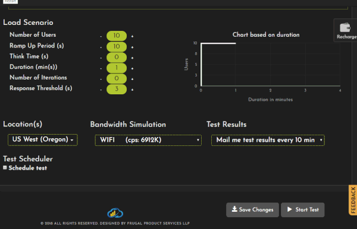

<b>FrugalTest</b> announces <b>AWS cloud </b>regions to load testing and stress testing for your application, either website testing or mobile testing from across the globe to know the responsiveness and user experience of your application beforehand from different regions.

The regions supported by FrugalTesting:

<ul class="blog-content">
<li>US (Oregon)</li>
<li>US (Virginia)</li>
<li>US (Ohio)</li>
<li>US (California)</li>
<li>Europe (Frankfurt)</li>
<li>Europe (Ireland)</li>
<li>Europe (London)</li>
<li>Asia (Tokyo)</li>
<li>Asia (Seoul)</li>
<li>Asia (Singapore)</li>
<li>Asia (Mumbai)</li>
<li>Australia (Sydney) </li>
</ul>

Select as many regions you want to fire load with different user load configurations in a <b>single test,</b>
and know how the application is behaving per region in a real time report analysis and can<b> visualize </b>the on-going test according to user selected time zone.

<h5 style="margin-left:5px;">Check out the per location results</h5>

In the summary report at the top right most corner of the dashboard, select Location for which you want to see the result from the dropdown box.

<h5 style="margin-left:70px;">Response Time over Time Graph plotted for each URL per Location</h5>

The overall requests per each location can be seen as above. Similarly, it can be seen with other metrics too.

<h5 style="margin-left:70px;">Response Time over Time Graph plotted for each URL per Location</h5>

If you have chosen a particular location to view how the request/s behaved, it gives you a detailed analysis of each request of that particular location.

 Get your first hands on experience at testing with our <a href="https://www.frugaltesting.com/blog/start-your-first-free-load-test">free load and performance testing services</a> test now at <a href="https://www.frugaltesting.com">www.frugaltesting.com</a> either URL test / JMX test to get real time insights of your application behaviour from any geographic location for an increased quality assurance.

