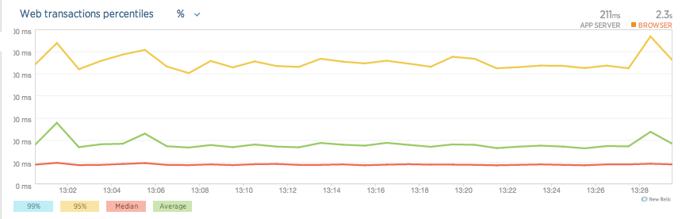
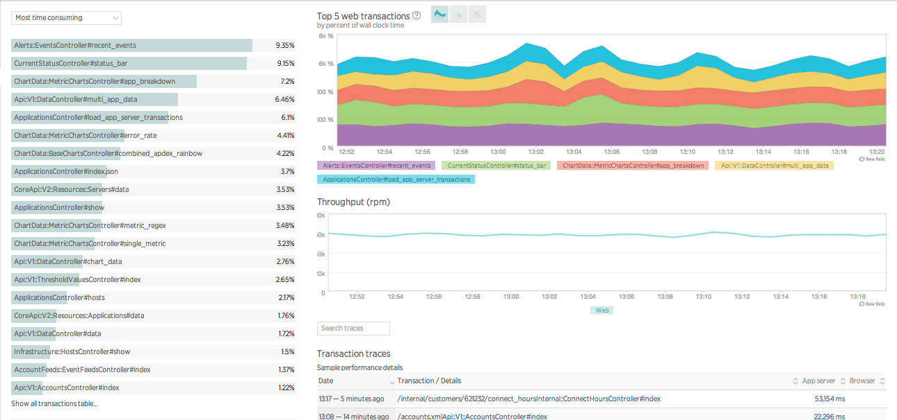
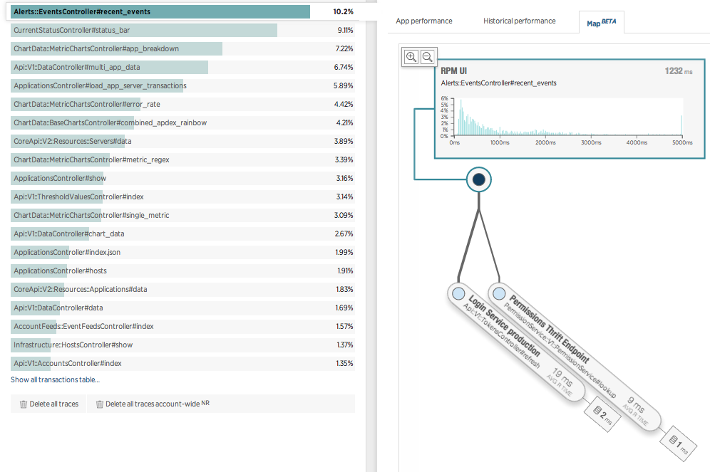
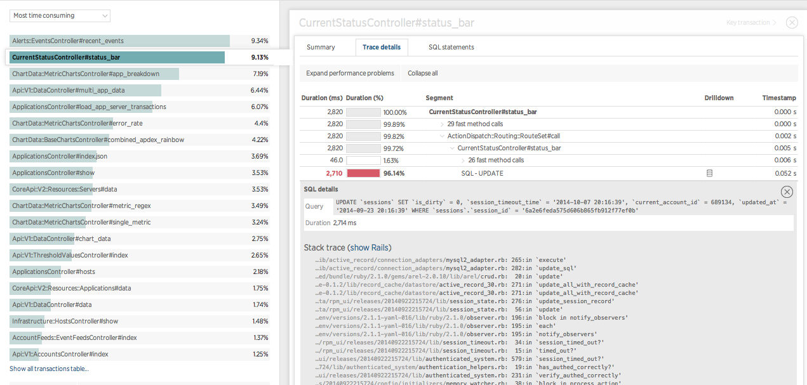
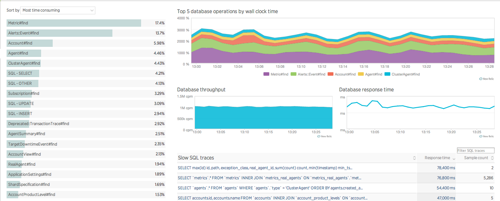
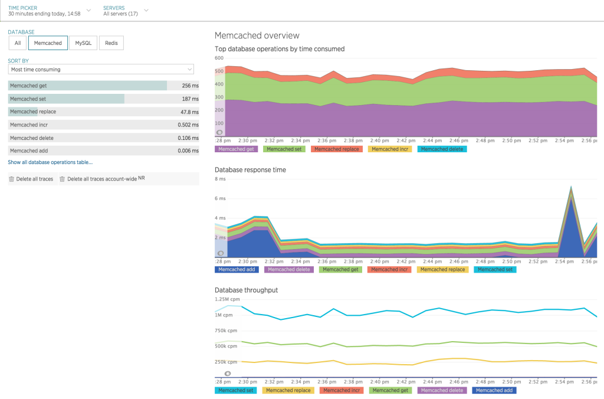
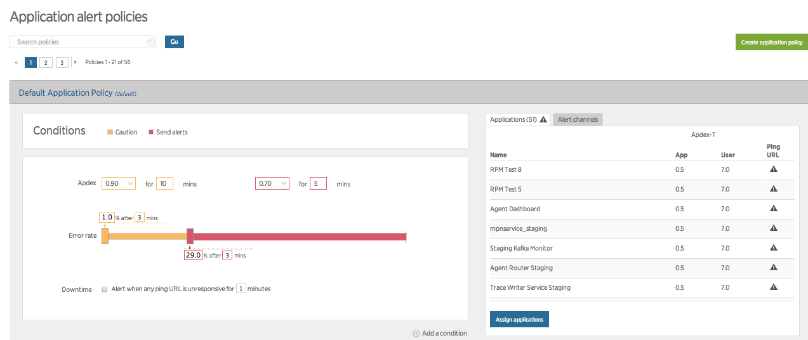
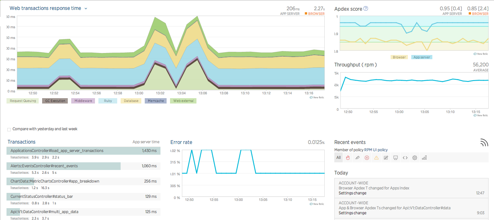

---
<<<<<<< HEAD
title: 'How APM helps to find the bottlenecks in Application on Load Testing'
=======
>>>>>>> 6dda810212e0edce5b50648a508d621d082e8b37
date: 2017-08-11
author: frugaltesting.com
featured: false
image: ./how-apm-helps-to-find-the-bottlenecks-in-your-application-while-doing-load-testing.png
description: "To find how the system is behaving under certain load conditions, we need an APM..." 

category:
  - Load Testing
  - Performance testing
---

To find how the system is behaving under certain load conditions, we need an APM (Application Performance Management) tool integrated to the application to find where the bottleneck is lying in the system which is the cause of poor performance. The most common performance issues are:

<strong> Poor scalability </strong> If software cannot handle the desired number of concurrent users, long load time, errors percentage increases, or other unexpected behaviour could happen that affects:

<ul class="blog-content">
<li>Disk usage</li>
<li>CPU usage</li>
<li>Memory leaks</li>
<li>Operating system limitations</li>
<li>Poor network configuration </li>
</ul>

<strong>Insufficient hardware resources</strong> Performance testing may reveal physical memory constraints or low-performing CPUs.

<strong>Software configuration issues</strong> Often, certain settings are not set at a sufficient level to handle the workload.

<strong>Poorly written code</strong> Which could refer to inefficient code, memory leaks, or synchronization issues and deadlock due to ineffectual algorithms. You can tackle this issue by ensuring that your developers are using the optimal coding practices, as well as some automated tools such as profilers and code reviews.

<strong>Unoptimized Databases</strong> poor query optimization, when one app function triggers multiple data requests and transfers of data. Or a DB may take too long to return results due to poor indexing.

<strong>Third-Party Services </strong> make sure the third-party services used by the application may not impact the performance. 

New Relic provides a powerful ability to analyse errors. With New Relic agents, you can see the error stack trace, message, and the line of code from which the error was thrown. We can also slice and dice the errors discovered in their applications over time and save hours of manual analysis by using NRAI to instantly identify what'	s different about their error transactions.

Some Exclusive features of New Relic APM:

<ul class="blog-content" style="color=black !important; padding-left:10px;font-size:15px;" type="disc">
<li><strong>Application Monitoring</strong>: Application Monitoring in one place allows you to see your application performance trends at a glance - from page load times, to error rates, slow transactions, and a list of servers running the app.
<ul class="blog-content" type="circle">
<li>Response Time, Throughput, and Error Rates - Response time is an average of the total time spent across all web transactions occurring within a selected time frame on the server-side. Throughput is requests per minute through the application. Error rates measures the percentage of errors over a set time period for your application.</li>
<li>Application Histograms &amp; Percentiles - This shows you the distribution of response times for all of your transactions. It will provide you the kind of actionable data you need to quickly pinpoint and troubleshoot problems

</li>
<li>Most Time-Consuming Transactions - This list of most time-consuming web transactions provides aggregated details around the surfaced slow transactions occurring during a specified time.

</li>
<li>Performance of External Services - The external services dashboard provides charts with your top five external services by response time and external calls per minute. Such as web services, resources in the cloud, and any other network calls.</li>
<li>Thread Profile - Stack traces are collected over a specified duration, aggregated and displayed in a detailed call tree for fine-grained diagnosis. This makes performance monitoring at its easiest.

</li>
<li>Cross Application Tracing - Provides you end-to-end visibility and automatically maps each tier of highly distributed and service-oriented apps in our Application Topology Map to easily visualize the relationship between tiers.

</li>
<li>Transaction Breakdown - Receive performance details of each segment including % time, average calls per transaction, and average time.

</li>
</ul>
</li>
</ul>
<ul class="blog-content" style="color=black !important;" type="disc">
<li><strong>Database Monitoring</strong>: Database monitoring provides a detailed overview of your database performance - pointing out critical errors that are slowing down your application.
<ul class="blog-content" type="circle">
<li>Time spent - The database overview provides a stack ranking of the most time consuming database calls along with aggregated metrics around response times and throughput and slow SQL traces.

</li>
<li>SQL Query Analysis - Track the exact SQL statements that are slowing down your site. Get samples of the worst performing SQL and stack traces to understand exactly where the SQL is used in your code, and how to fix it.</li>
<li>Slow SQL Report - Slow SQL samples are examples of the worst performing SQL on your site. Along with the SQL, New Relic collects the context and diagnostic information you need to fix your database performance issues.</li>
<li>Database/cache operations - ‘All Operations Table’ that is designed to show every operation for all databases and caches for the app within the selected time window.

</li>
</ul>
</li>
</ul>
<ul class="blog-content" style="color=black !important;" type="disc">
<li>
<strong>Availability &amp; Error Monitoring</strong>

<ul class="blog-content" type="circle">
<li>Alert Policies - Alert policies allow you to set thresholds for groups of applications with similar alerting needs.

</li>
<li>Availability Monitoring - New Relic uses an external pinger to verify your users can reach your application site, by making requests to them regularly, recording errors, and sending downtime alerts when an application is down.</li>
</ul>
</li>
</ul>
<ul class="blog-content" style="color=black !important;" type="disc">
<li><strong>Reports</strong>: Create and receive customized reports that are just as easy to read as they are to share. Our detailed reports include everything from deployments and availability, to performance and customized dashboards.

</li>
</ul>
<ul class="blog-content" style="color=black !important;">

With few more feature for pro users, which helps to detect the bottlenecks in the application more effectively.Performance testing and APM monitoring go hand in hand to find the root cause of bottlenecks quickly and efficiently.

<li>Test your application performance much before it goes live. </li>
<li>Test the application under various load scenarios. </li>
<li>Test with realistic scenarios by adding think time, pacing, etc</li>
</ul>

<strong>These are some of the features improved in <a href="whats-new-in-jmeter-5.0"> JMeter 5.0</a>.</strong>

