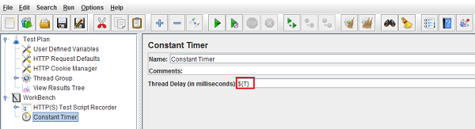

The Proxy Server allows JMeter to record all the actions while user browses web/mobile application.
The recorded actions are stored under the test plan in JMeter.

JMeter script should be prepared in a realistic way i.e. by adding delay between each user action which we call it as Think time. Think time allows the virtual users/threads to pause between the business flows, while moving from one to another transaction.
As in real scenario users will never login, search, place order, payment and logout within few seconds as the user needs some time to think and do next action.

So including a Think time in the test plan makes the performance test more realistic as it represents user's actual behaviour in the system.

<h4 class="blog-subtitle">Following the steps for a Realistic test plan:</h4>
<ol >
<li>Create a new test-plan and switch to WorkBench and add HTTP(s) Test Script Recorder.</li>
<li> Now, add Constant Timer to HTTP(S) Test Script Recorder and set Thread Delay (in milliseconds) in Constant Timer as . It tells the proxy server to record your delay time while you browse rather than adding a constant time.

</li>
<li>Now configure your browser to use the JMeter Proxy and record the user actions of web/mobile application.</li>
<li>You can see the requests are recorded with Constant Timer with the exact time delay.

</li>
</ol>
<h4 class="blog-subtitle">Note:</h4>

We need to remove the first sampler's generated timer manually, since the first sampler usually does not need one.

Thus timer recorded the user think time in realistic scenario through Proxy Server.

Depending upon the application context, the think time would vary. It's not advisable to have the default think time for all applications under test.

