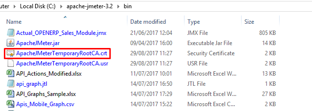

After setting the proxy configuration in mobile for recording, if the mobile traffic doesn't show up in JMeter while recording, just install JMeter Root CA certificate - in mobile device. It can be taken either from JMeter's bin folder present as Security Certificate or download it - <a href="https://gist.github.com/borisguery/9ef114c53b83e553b635" target="_blank">click to download</a>

After installing the certificate in the device, just start the HTTP(S) Test Script Recorder in JMeter. Now you will be able to see the traffic being recording.

