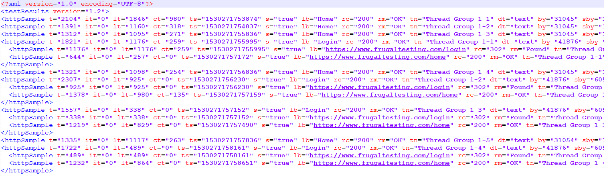

Generally when we want to load test a website, we want to select the <b>'Retrieve Embedded / resources' </b> option with 'Parallel Download' as a real user scenario in <a href="../../../../2018/06/25/introduction-to-apache-jmeter-guide">Jmeter</a>.

But to visualize the embedded / resources like JS, CSS, images etc. in JMeter, we only have <b>'View Result Tree' </b> listener which we can't use for huge load tests.

So, to get the various performance attributes of the child elements like sample times and response codes, save the jtl file in XML format as follows:

<ul >
<li>Go to jmeter.properties and set jmeter.save.saveservice.output_format=xml.</li>
<li> Save it and Restart JMeter.

</li>
<li>Or you can pass it command line as -Jjmeter.save.saveservice.output_format=xml

</li>
<li>And here you get jtl file with XML format:

</li>
<li>On changing the format of jtl file to xml, and choosing 'View Result Tree' listener, you can see Sampler result data related to all child elements as well.

</li>
</ul>

Know <a href="../../../../2017/10/24/how-to-get-child-samples-when-embedded-resource-is-checked-in-jmeter">how huge load on website can impact your application's performance here!</a>

