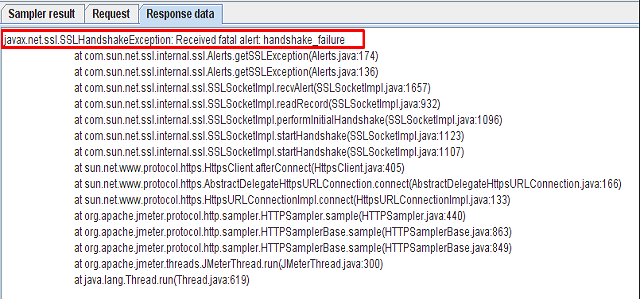

If you get below error as response data for a request while running the script, here is the solution.

In HTTP Request sampler, change the field 'Implementation' to HttpClient4 to solve this exception.

