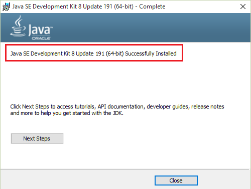
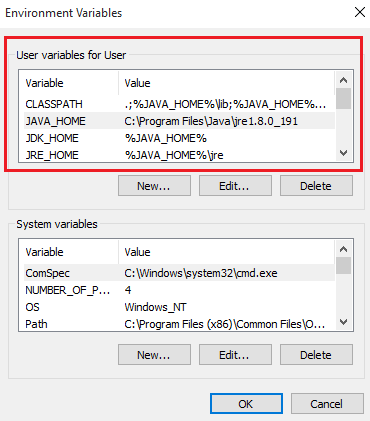
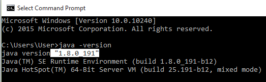

As <a href="introduction-to-apache-jmeter-aquick-guide">Apache JMeter</a> is a pure JAVA based open source tool, we need a compatible Java version to run Apache JMeter. So let's start with how to install Java.
Check the below table which states which Java version has to be downloaded to make both JMeter and Java compatible.

<table class="table table-bordered table-hover table-sm" style="color:black !important">
<tbody>
<tr>
<th>JMeter Version</th>
<th>Release Date</th>
<th>Java Version</th>
</tr>
<tr>
<td>2.13</td>
<td>2015-03-14</td>
<td>Java 6+</td>
</tr>
<tr>
<td>3.0</td>
<td>2016-05-17</td>
<td>Java 7+</td>
</tr>
<tr>
<td>3.1</td>
<td>2016-11-19</td>
<td>Java 7+</td>
</tr>
<tr><td>3.2</td>
<td>2017-04-13</td>
<td>Java 8+</td>
</tr>

<tr><td>3.3</td>
<td>2017-09-21</td>
<td>Java 8+</td>
</tr>
<tr><td>4.0</td>
<td>2018-02-10</td>
<td>Java 8 or 9</td>
</tr>
<tr><td>5.0</td>
<td>2018-09-18</td>
<td>Java 8 or 9</td>
</tr>
</tbody>
</table>

If you are using latest version of JMeter we can see it requires Java 8+. So let's see how to install Java 8.  
To download the Java 8 go to the official <a href="https://www.oracle.com/technetwork/java/javase/downloads/index.html">site </a>of oracle, under Java Platform, Standard Edition you can find the latest version of Java which is of Java SE 8u191/ Java SE 8u192.

By clicking on the link you will be redirecting to the <b>Java SE Development Kit 8 Downloads</b>, accept the license agreement and click on the <b>Windows x 84/ 64 </b>accordingly.

You can find .exe find being downloaded. Once the download was done just install the application.
You can find the Java was installed was installed successfully.

Now we need to instruct our windows OS to pick this version of Java, so we need to setup the environmental variables by navigating through <b>Control Panel</b> &gt; <b>System</b> &gt; <b>Advanced system settings</b>.

Now switch to Advanced tab &gt; Environment Variables.

Under User Variables, Click on <b>New</b> and add the following <b>Variable name</b> and <b>Variable value</b>.

<table class="table table-bordered table-hover table-sm" style="color:black !important">
<thead>
<tr class="table-primary" style="background-color:rgba(0,0,0,0.06)">
<th>Variable name</th>
<th>Variable value</th>
</tr>
</thead>
<tbody>
<tr>
<td>JAVA_HOME</td>
<td>C:\Program Files\Java\jre1.8.0_191</td>
</tr>
<tr>
<td>JDK_HOME</td>
<td>%JAVA_HOME%</td>
</tr>
<tr>
<td>JRE_HOME</td>
<td>%JAVA_HOME%\jre</td>
</tr>
<tr>
<td>CLASSPATH</td>
<td>.;%JAVA_HOME%\lib;%JAVA_HOME%\jre\lib</td>
</tr>
<tr>
<td>PATH</td>
<td>;%JAVA_HOME%\bin</td>
</tr>
</tbody>
</table>

Make sure that the longish your-unique-entries do not contain any other references to another Java installation folder.
Note that these environment variables are derived from the `root` environment variable JAVA_HOME. This makes it easy to update environment variables when updating the JDK.
And don't delete any existing entries.
Once it was done verify the java installation by going to command prompt and execute java-version. You can see the java was installed successfully.

