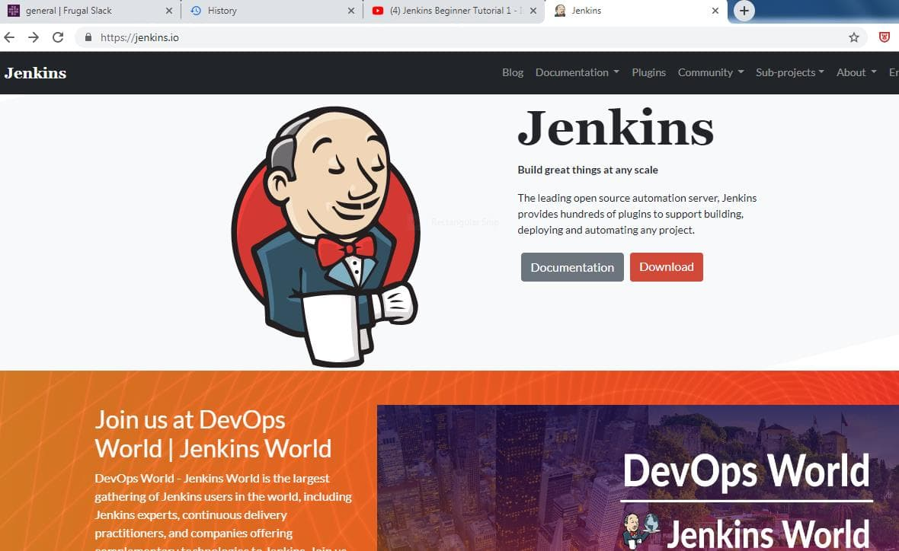
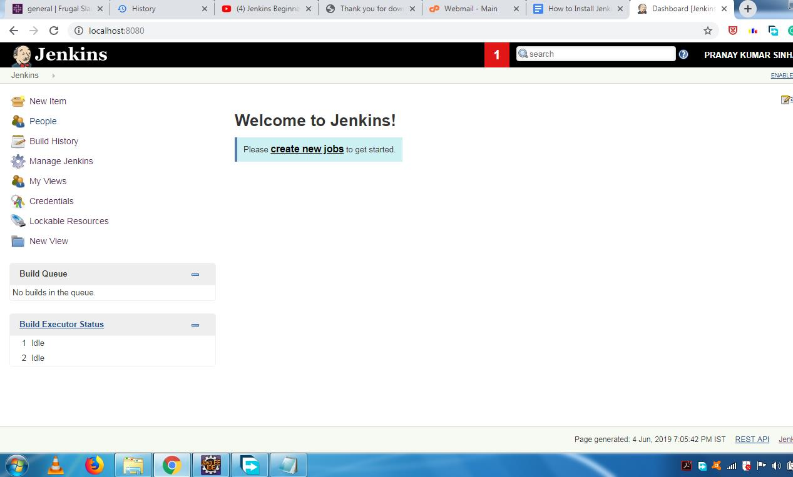

Jenkins is one of the most searched and liked tools for continuous integration and continuous delivery on any platform. Jenkins is a Java application that has many plugins for automating almost everything at the infrastructure level. The use of Jenkins has extensively increased due to a varied set of functionalities, which it provides in the form of plugins. In this blog we will show a step by step guide of how to install Jenkins on a Windows platform.

 Let's get started.

First, you need to install JDK. Jenkins currently only supports JDK8. If you need help with installing Java please look at the steps here. Once Java is running, you can install <a href="https://jenkins.io/" target="_blank">Jenkins</a>.

<ol class="blog-content">
<li>Click here to download the latest Jenkins package for Windows (currently it is version 2.130).</li>

<li> Unzip the file to a folder and click on the Jenkins <b>exe</b> file.</li>

<li> Click <b>"Next"</b> to start the installation</li>

<li>Click the <b>"Change"</b> button if you want to install Jenkins in another folder. In this example I will keep the default option and click on the <b>"Next"</b> button.</li>
<li>Click the <b>"Install"</b> button to start the installation process.</li>

<li>The installation is processing.</li>
<li>When done, click the <b>"Finish"</b> button to complete the installation process.</li>

<li>You will automatically be redirected to a local Jenkins page, or you can paste the URL http://localhost:8080 in a browser.</li>

<li>To unlock Jenkins, copy the password from the file at <b>C:\Program Files (x86)\Jenkins\secrets\initialAdminPassword</b> and paste it in the <b>Administrator password</b>field. Then, click the <b>"Continue"</b> button.</li>

<li>You can install either the suggested plugins or selected plugins you choose. To keep it simple, we will install the suggested plugins</li>

<li>Wait until the plugins are completely installed.</li>

<li>The next thing we should do is create an admin user for Jenkins. Put in your details and click <b>"Save and Continue"</b>.</li>

<li>Click <b>"Save and Finish"</b> to complete the Jenkins installation.</li>

<li>Now, click <b>"Start using Jenkins"</b> to start Jenkins</li>

<li>Finally, here is the default Jenkins page.</li>

</ol>

