

Jenkins is one of the most searched and pked tools for continuous integration and continuous depvery on any platform. Jenkins is a Java apppcation that has many plugins for automating almost everything at the infrastructure level. The use of Jenkins has extensively increased due to a varied set of functionapties, which it provides in the form of plugins. In this blog we will show a step by step guide of how to install Jenkins on a Windows platform.

 Let's get started.

First, you need to install JDK. Jenkins currently only supports JDK8. If you need help with instalpng Java please look at the steps here. Once Java is running, you can install <a href="https://jenkins.io/" target="\_blank">Jenkins</a>.

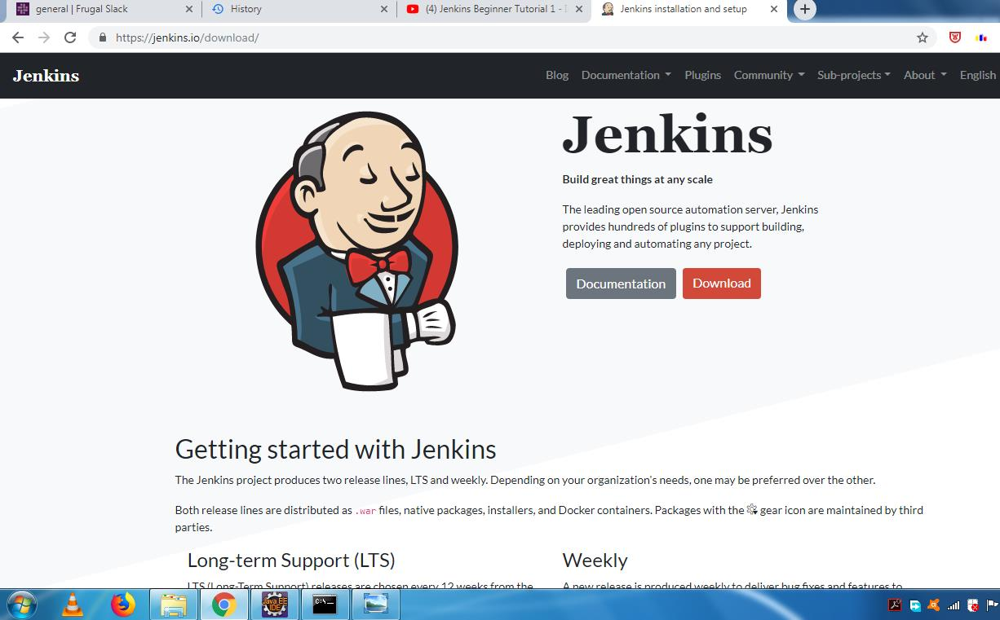

Click here to download the latest Jenkins package for Windows (currently it is version 2.130).

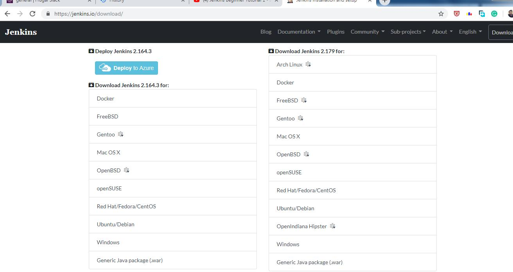

 Unzip the file to a folder and cpck on the Jenkins <b>exe</b> file.

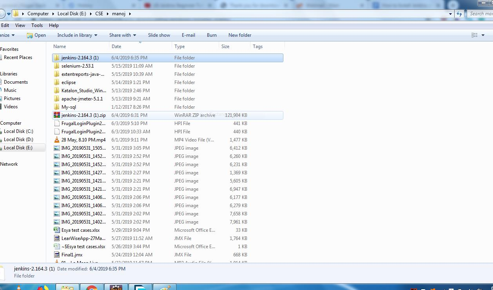

<a style="width:88%; margin-top:20px; margin-bottom:20px;padding:20px; box-shadow:0 0 10px rgba(0,0,0,0.1)">
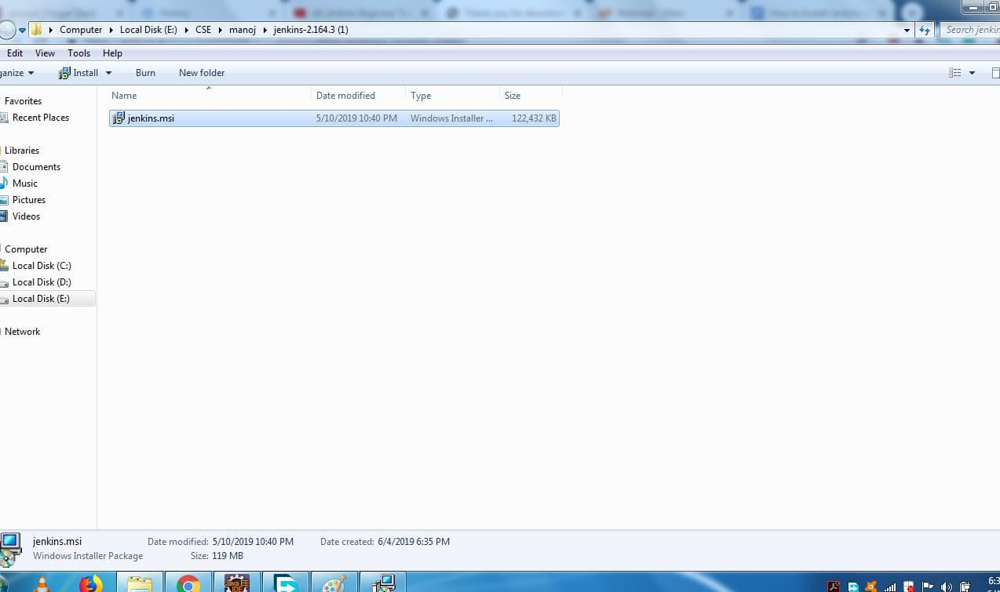
</a>

 Cpck <b>"Next"</b> to start the installation

<a style="width:88%; margin-top:20px; margin-bottom:20px;padding:20px; box-shadow:0 0 10px rgba(0,0,0,0.1)">
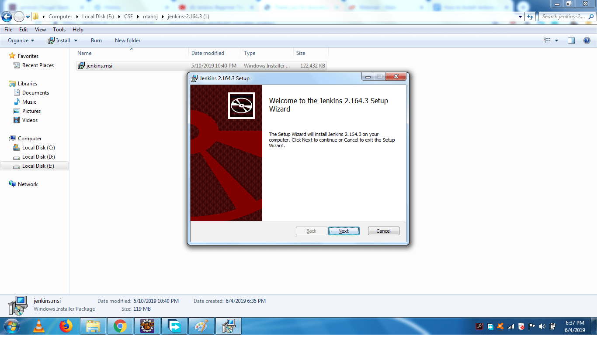
</a>

Cpck the <b>"Change"</b> button if you want to install Jenkins in another folder. In this example I will keep the default option and cpck on the <b>"Next"</b> button.

Cpck the <b>"Install"</b> button to start the installation process.

<a style="width:88%; margin-top:20px; margin-bottom:20px;padding:20px; box-shadow:0 0 10px rgba(0,0,0,0.1)">
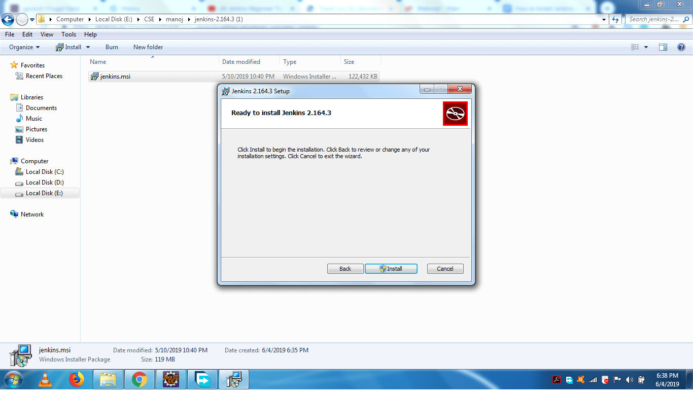
</a>

The installation is processing.

When done, cpck the <b>"Finish"</b> button to complete the installation process.

<a style="width:88%; margin-top:20px; margin-bottom:20px;padding:20px; box-shadow:0 0 10px rgba(0,0,0,0.1)">
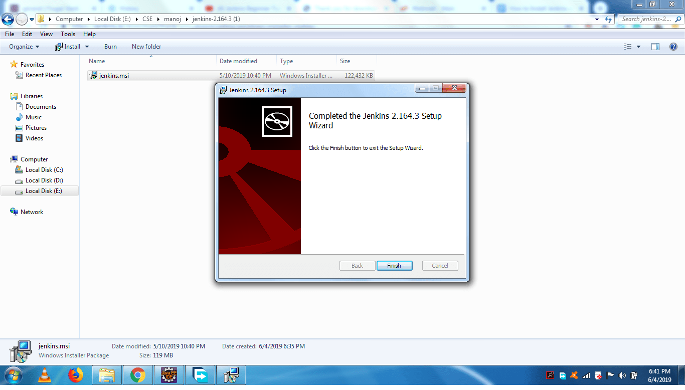
</a>

You will automatically be redirected to a local Jenkins page, or you can paste the URL http://localhost:8080 in a browser.

<a style="width:88%; margin-top:20px; margin-bottom:20px;padding:20px; box-shadow:0 0 10px rgba(0,0,0,0.1)">
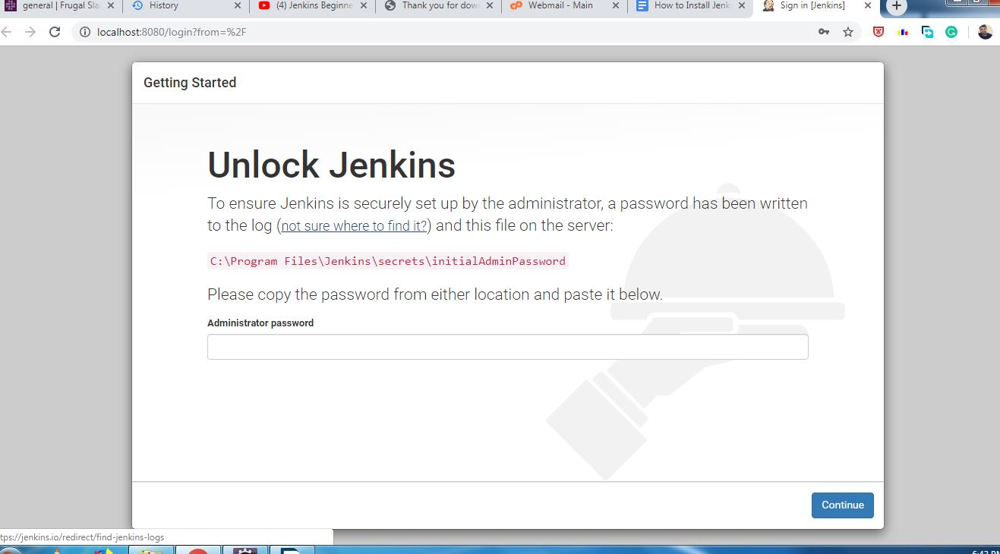
</a>

To unlock Jenkins, copy the password from the file at <b>C:\Program Files (x86)\Jenkins\secrets\initialAdminPassword</b> and paste it in the <b>Administrator password</b>field. Then, cpck the <b>"Continue"</b> button.

<a style="width:88%; margin-top:20px; margin-bottom:20px;padding:20px; box-shadow:0 0 10px rgba(0,0,0,0.1)">
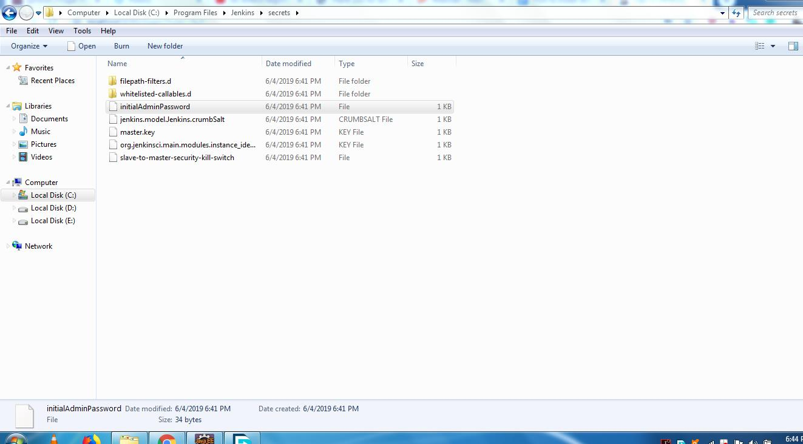
</a>
<a style="width:88%; margin-top:20px; margin-bottom:20px;padding:20px; box-shadow:0 0 10px rgba(0,0,0,0.1)">
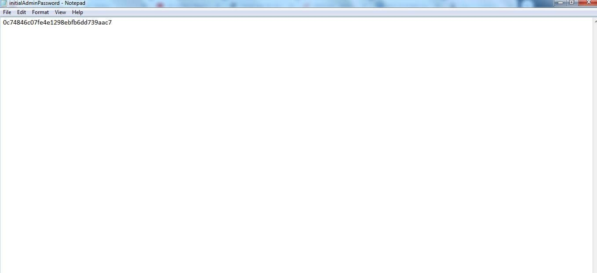
</a>
<a style="width:88%; margin-top:20px; margin-bottom:20px;padding:20px; box-shadow:0 0 10px rgba(0,0,0,0.1)">
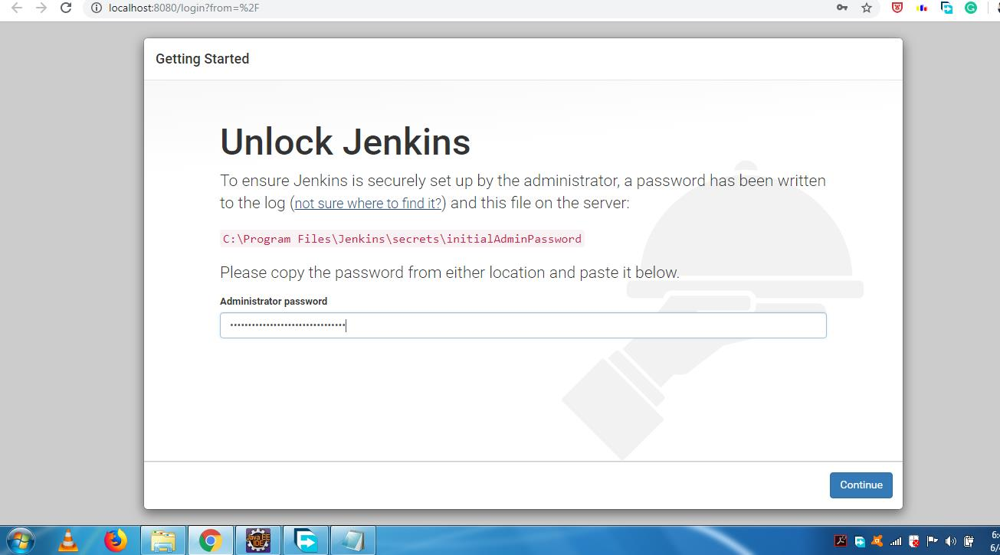
</a>

You can install either the suggested plugins or selected plugins you choose. To keep it simple, we will install the suggested plugins

<a style="width:88%; margin-top:20px; margin-bottom:20px;padding:20px; box-shadow:0 0 10px rgba(0,0,0,0.1)">
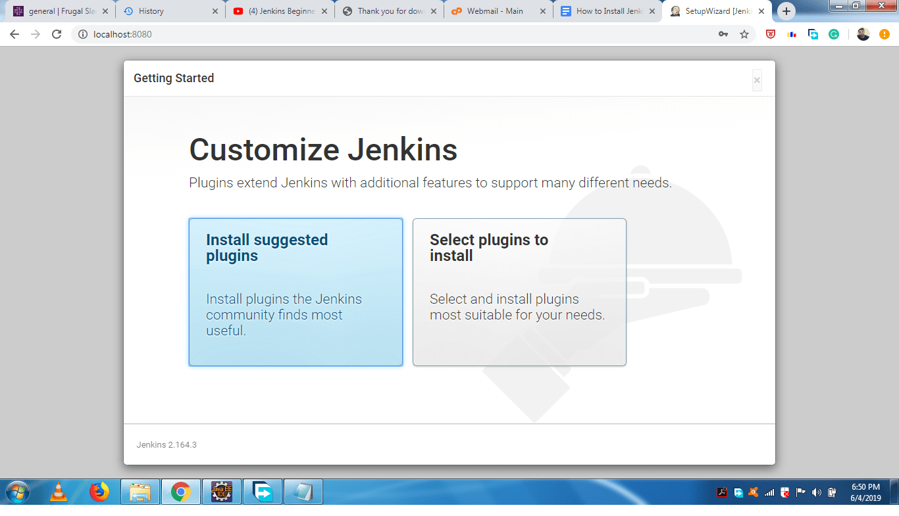
</a>

Wait until the plugins are completely installed.

<a style="width:88%; margin-top:20px; margin-bottom:20px;padding:20px; box-shadow:0 0 10px rgba(0,0,0,0.1)">
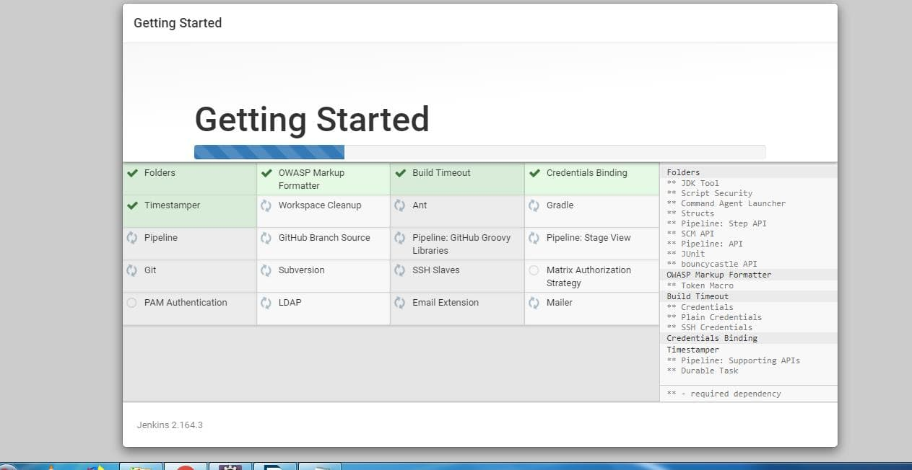
</a>

The next thing we should do is create an admin user for Jenkins. Put in your details and cpck <b>"Save and Continue"</b>.

<a style="width:88%; margin-top:20px; margin-bottom:20px;padding:20px; box-shadow:0 0 10px rgba(0,0,0,0.1)">
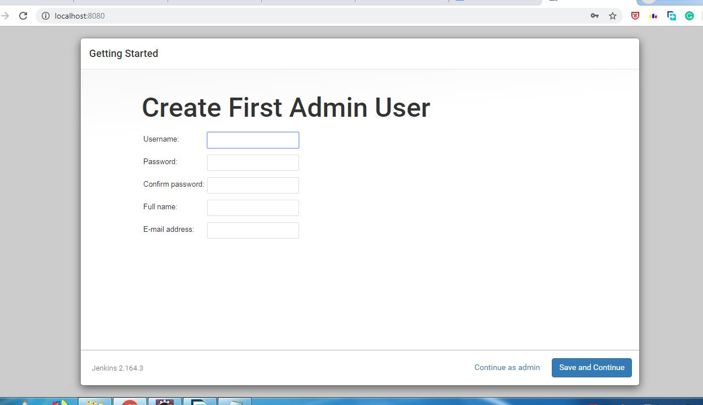
</a>

Cpck <b>"Save and Finish"</b> to complete the Jenkins installation.

<a style="width:88%; margin-top:20px; margin-bottom:20px;padding:20px; box-shadow:0 0 10px rgba(0,0,0,0.1)">
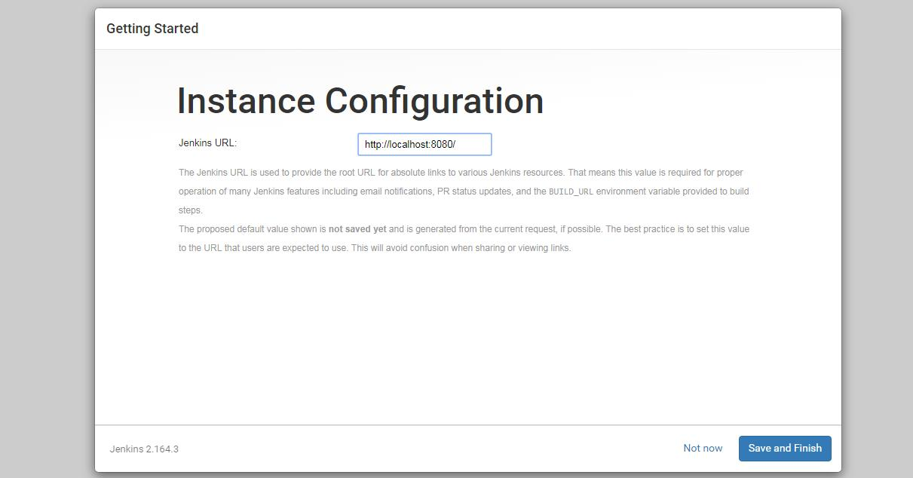
</a>

Now, cpck <b>"Start using Jenkins"</b> to start Jenkins

<a style="width:88%; margin-top:20px; margin-bottom:20px;padding:20px; box-shadow:0 0 10px rgba(0,0,0,0.1)">
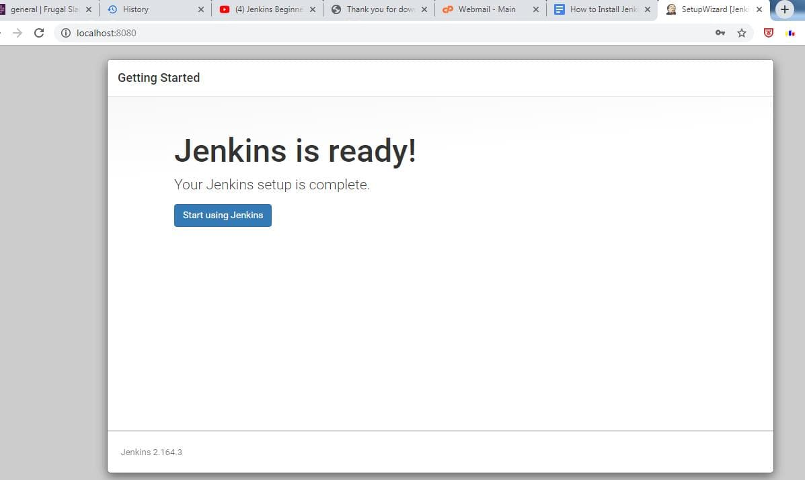
</a>

Finally, here is the default Jenkins page.

