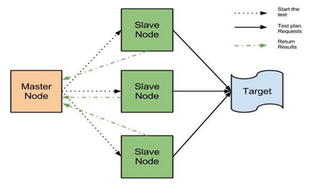
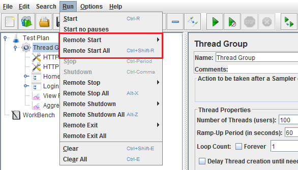
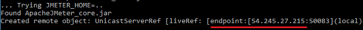

As JMeter has some limitations for generating requests from one single machine, we go for distributed testing to overcome it. In <b>distributed testing</b> we configure a Master machine and certain number of slave machines (and the no of slaves depends upon the load/users) to simulate load with more numbers of users. The master machine controls the test and slaves do the actual job.

Let's consider 4 machines which are setup on cloud with 8GB RAM configuration. One will be termed as Master and other 3 will act as slave machines.

<ul >

 Now, steps to be done before starting the distributed testing through GUI:

<li>Ensure that the 'system firewall' is turned off </li>
<li> Download latest and same version of Apache JMeter along with the supported version of Java.</li>
<li>Now open the <b>jmeter.properties</b> file of the master machine, and add remote_hosts=192.168.10.01,54.153.130.212,54.215.185.156 (IPs of slave machines) under <b>Remote hosts and RMI configuration.</b>

</li>
<li> Though there is no need to start RMI registry separately, but if you want to run the JMeter on specific port, you can define in <b>jmeter. properties</b> with following command:
- server.rmi.localport=4000 (define the port)</li>
<li>Now open <b>jmeter-server.bat</b> file in all the slave machines.

</li>
<li>In master machine, just open JMeter (jmeter.bat) in GUI and select the test plan which you want to run and click <b>Run</b> in the we can see 'Remote Start' (or) 'Remote Start All' (we can see the IP of three slaves which we given in jmeter.properties file).

</li>
<li>By selecting <b>Remote Start All,</b> all the slave systems will get started. We can see in jmeter-server.bat file of slave machines.

</li>
<li>We will get the test results in Master-JMeter GUI itself.</li>

<h4 class="blog-subtitle">To run the test through command line (NON-GUI MODE):</h4>
<ol >
<li>After setting up JMeter and turning off the system firewall.</li>
<li>In slave machine go to CL (Command Line) and set the path to JMeter-bin and give the following command: 
- jmeter-server.bat -Djava.rmi.server.hostname=54.215.185.156 (ip of slave machine) say enter we can see the end point to 54.215.185.156.

</li>
<li style="margin-top:20px;"> Now in Master machine open CL and set the path to JMeter-bin and pass the following command: 
- jmeter.bat -n -t nameofjmx.jmx -l sample.jtl -R 192.168.10.01,192.168.10.02,192.168.10.03 (Slave machine ips).</li>
<li>You can find the <b> remote engines have been started</b> in Master.

</li>
<li style="margin-top:20px;"> After the completion of test take the jtl file and browse it in JMeter GUI to get Aggregate Report or any other Graphs.</li>
</ol></ul>

To know more about apache JMeter,<a href="../../../2018/06/25/introduction-to-apache-jmeter-guide"> read here</a>.

