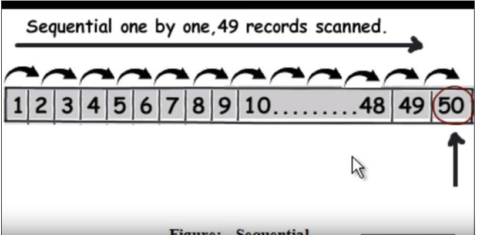
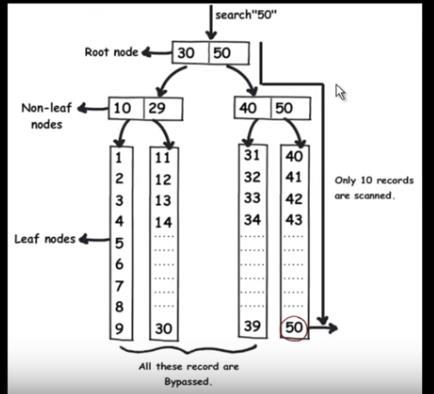
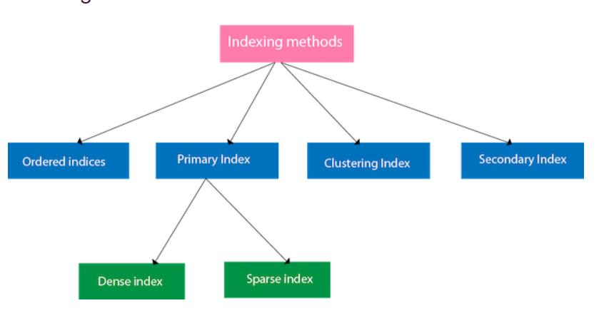

What is Indexing? 
-----------------

Supposedly, we have a piece of information of about 10,000 lines. We may
not want to store as much all at once so we decide it to store it in 10
books of 1000 pages each. This analogy is quite similar to files being
stored in blocks on the disk and records being contained in each block.
Now, we have to access a record in the block and it may happen that
there are numerous blocks but we want to access the information of just
one particular block. This may turn out to be a slow process and we
really want to fasten it up. There may be a case that the block we want
to search may or may not be sorted. If sorted, we may apply the binary
search and access the record which will definitely take some time. But
what if the file is unsorted? In that case, we have to access all the
records to get that file.

\

Thus, to make this search faster, we can decrease the access time to
search a record we use indexing.\
 **Indexes are all about finding data quickly.**

Indexes in a database are analogous to indexes that you find in a book.
If a book has an index, and I ask you to find a chapter in that book,
you can quickly find it with the help of the index. On the other hand,
if the book does not have an index, you will have to spend more time
looking for the chapter, running through every page. In a similar
fashion, indexes in a database can help queries to find data quickly.

Indexing is a way to optimize the performance of a database by
minimizing the number of disk accesses required when a query is
processed. An index or database index is a data structure that is used
to quickly locate and access the data in a database table.

Ways to perform Indexing 
------------------------

We use an index table that has two fields: the search key( Anchor) and
the Block Pointer(Reference Pointers). The analogy is the index that is
present at the end of the book with the word and pages mentioned there.
The search key is similar to the the word in the dictionary and the
block pointer is similar to the page number which is pointing to the
occurrence of that word in the book. So the book pointer points to the
base address of the block where the search string is present. In Fig.1
supposedly, the query is to find 50th record , it will have to read 49
records as a linear search. When we apply indexing, the query will
quickly find out the data without reading each one of them just by
eliminating half of the data in each traversal like a binary search. The
mysql indexes are stored as B-tree where all the data are in leaf node.

\

Types of Indexing 
-----------------

The indexing can be clasified into two types:

-   **Single level indexing**
-   **Multi-level indexing**

**Single-level indexing**

The single level indexing implies that the indexing is done only once.
This means the index table is created once. The single level indexing
can be classified into 3 types:

​a) Primary Indexing

The primary indexing is done when the main file for which the index
table is created is a sorted file.\
 The anchor used in the primary indexing is the primary key of the main
table.\
 This can further be classified into two types:

-   Sparse indexing: The index record appears only for a few items in
    the data file. Each item points to a block as shown. To locate a
    record, we find the index record with the largest search key value
    less than or equal to the search key value we are looking for. We
    start at that record pointed to by the index record, and proceed
    along the pointers in the file (that is, sequentially) until we find
    the desired record.
-   Dense indexing: For every search key value in the data file, there
    is an index record. This record contains the search key and also a
    reference to the first data record with that search key value.

​b) Secondary Indexing

The secondary indexing is done on an unsorted main file. Here the anchor
may be a key value or non-key value. This means it can be unique or not.

​c) Clustering Indexing

It is done on the sorted main file but the anchor value is a non-key
value

​d) Odered Indexing

The indices are usually sorted so that the searching is faster. The
indices which are sorted are known as ordered indices.

**Multi-level indexing**

When the index table is created for some other index table, then this
type of indexing is called multi-level indexing. \
\
 The types of indexing are shown in the Fig.3 below:

\

**Advantages of indexes:** 
----------------------

1.  Useful in finding data quickly
2.  Results in much better performance
3.  Unique records

**Disadvantages of indexes:** 
-------------------------

1.  Additional disk space
2.  Insert update delete statement can become slow
3.  If there exists a covering query then there is no need to lookup in
    the table
4.  A clustered index always covers a query

