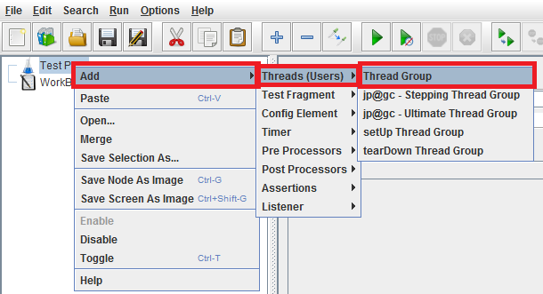
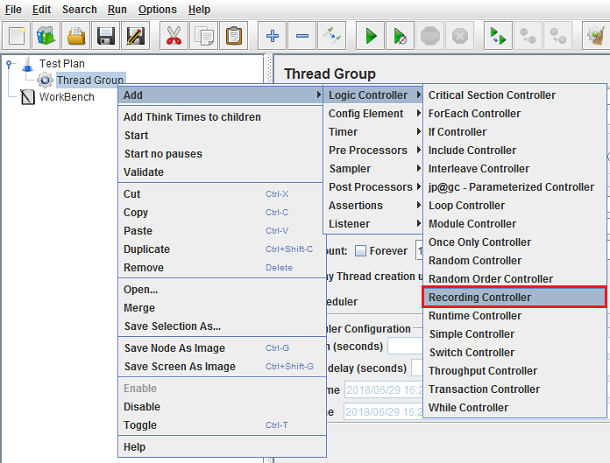
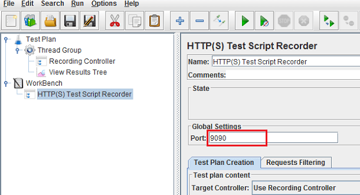
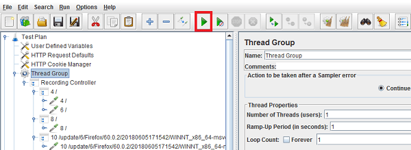

Recording of <b>mobile</b> applications traffic is not much different from what we do to record script for web applications. All we have to do is put proper proxy in place for mobile device. Follow the below steps for <b>Android</b> or <b>iOS</b> mobile.

<ol >
<li>Open JMeter and right-click the <b>Test Plan&gt;&gt;Add &gt;&gt;Threads (Users)&gt;&gt;Thread Group. </b>

</li>
<li>Right-click the <b>Thread group&gt;&gt;Add&gt;&gt;Logic Controller&gt;&gt;Recording Controller.</b>

</li>
<li>Right-click the <b>Threads&gt;&gt;Add&gt;&gt;Listener&gt;&gt;View Results Tree </b> (to see response data while running the script).

</li>
<li> Add test script recorder by selecting <b>Add&gt;Non-Test Elements&gt;HTTP(S) Test Script Recorder </b> option.

</li>
<li> Add <b>'8080'</b> as Port value and click the Start button. This will start the JMeter proxy on localhost.

</li>
<li>On <b>'Start'</b> of HTTP(S) Script Recorder you will see a dialogue box of Root CA Certificate just click the <b>'OK'</b> button to get rid of it.

</li>
</ol>
<h4 class="blog-subtitle">Android proxy configuration:</h4>
<ol >
<li>Go to <b> Settings &gt; Wi-Fi </b> option (the shared Wi-Fi network should be same for both Mobile and PC where JMeter is installed).</li>
<li>Long tap the network which you are connected and click the <b>'Modify Network' </b> option.</li>
<li>And check the <b>'Advanced options'</b> check box.</li>
<li>This will open advanced settings from which we can modify proxy manually. For this, set <b>'Proxy'</b> option to <b>'Manual'.</b></li>
<li>Now, set <b>'Proxy hostname'</b> as your PC IP address and <b>'Proxy port'</b> to 8080 as we have set up in JMeter Proxy server.</li>
<li>Click <b>'Save'</b>, now you can start running the application on your mobile device and its requests will be recorded in JMeter.</li>
</ol>
<h4 class="blog-subtitle">IOS configuration:</h4>
<ol >
<li>Go to <b> Settings &gt; Wi-Fi</b> option (the shared Wi-Fi network should be same for both Mobile and PC where JMeter is installed).</li>
<li>Click on the connected network.</li>
<li>Select the <b>'Manual'</b> option from HTTP Proxy section.</li>
<li>Set the <b>'Server'</b> as your PC IP address and <b>'Port'</b> to 8080 as JMeter proxy server.</li>
</ol>
<h4 class="blog-subtitle">Recording Mobile App Script:</h4>
<ol >
<li>Before running any application, make sure that you click the <b> 'Start' </b>button on <b>HTTP(S) Test Script Recorder</b> in JMeter.</li>
<li>Open the mobile application you want to test and play around with the functionality the way you want it to be recorded in JMeter for load testing.</li>
<li>As we have set the mobile connection over <b>JMeter's proxy,</b> thus all test flow are recorded to <b>JMeter's Test Plan.</b></li>
<li>Once you are done with recording of all test flows of your application, stop the recording by <b>'Stop'</b> button on <b>'HTTP(S) Test Script Recorder'</b> in JMeter and save the <b> Test Plan.</b>

</li>
</ol>

Now run your <b>Test Plan</b> by clicking the <b>'Play'</b> button displayed in green.

After playing the <b> Test Plan </b> you can view the response of the each request in <b>'View Result Tree'.</b>

Your script is ready for load testing. You may further refine it by adding correlation, parameterization etc.

You can also load test your mobile applications in <a href="https://www.frugaltesting.com"> FrugalTesting </a>by just signing up to your
account and uploading your mobile application script either as jmx script or you can just give
the URLs of mobile app and set the load scenario and you are ready to start your load test.

