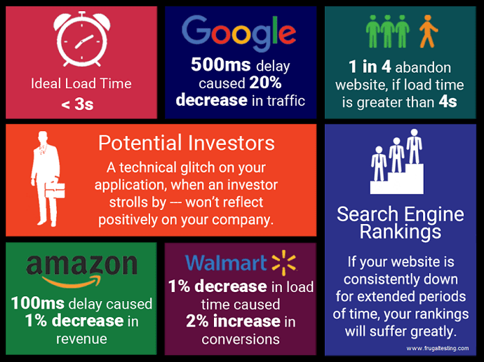

Today most entrepreneurs who have an online business model, put a lot of emphasis on SEO to drive more traffic to their website. The more hits you get to your website, the higher are the chances of conversion.
Sounds easy? Not really...!
Quick response is one of the significant factors for enhanced user experience which translates to higher conversion rate.
Just look at these numbers and rethink!

