

<b>Continuous Integration (CI) </b> is an essential part of the software development lifecycle (SDLC) as it automates software build, testing, and deployment processes, and performance monitoring is a key part of CI.
Implementing CI helps in:

<ul >
<li>Monitor source code repositories.</li>
<li>Run builds whenever code changes are detected.</li>
<li>Run tests against compiled software (unit, acceptance, automated, performance, integration).</li>
<li>Generate artifacts (binaries, documentation, installation packages).</li>
</ul>

Adding testing in CI process helps in reducing <b>performance </b>issues before and after adding (or) making changes in code builds of your software application.
As main motto of CI process is to detect any integration related issues as early as possible.
Now, let's consider <b>Jenkins </b>as Continuous Integration tool and JMeter tool for load testing.

 <b>Download and Install Jenkins:</b>

<ul >
<li>Download latest release of Jenkins (download .war file).</li>
<li>Now run Jenkins as java - jar jenkins.war (give path of jenkins.war file). You can find "Jenkins is fully up and running" message.</li>

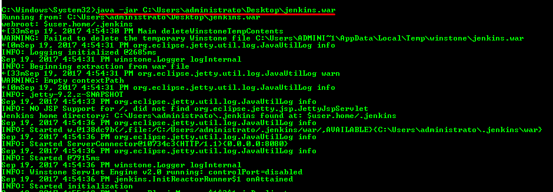

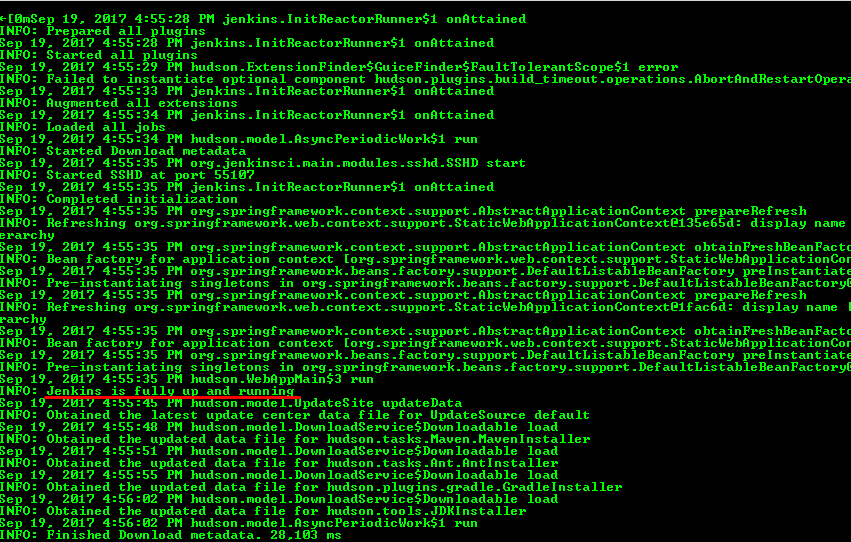

<li>Open your web browser and give http://localhost:8080 URL.</li>
<li>You can find this page asking to enter the password to unlock.</li>

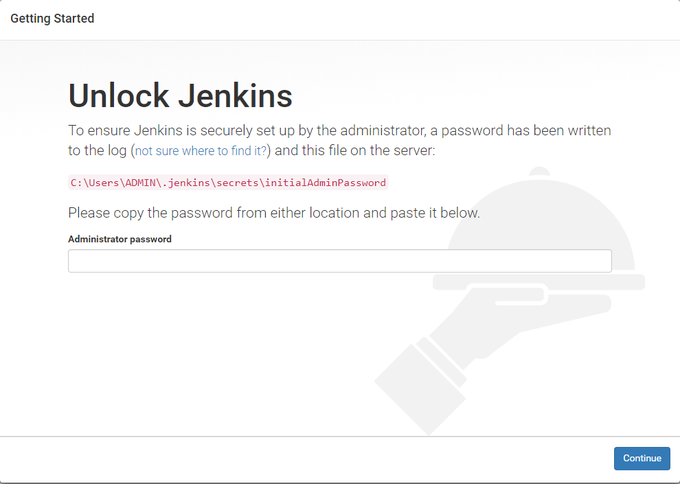

<li>Go to secrets folder which will be in <b>.jenkins </b> folder in your system and open <b>initialAdminPassword </b>and copy the password which was present.</li>

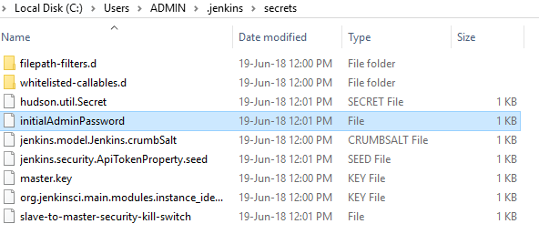

<li>Paste the password in the browser and say continue</li>

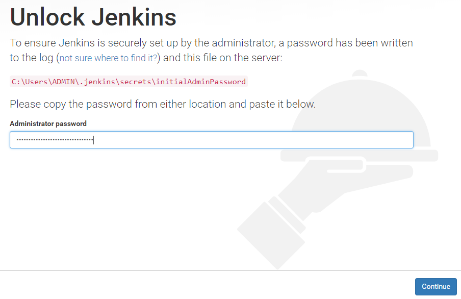

<li>After on click <b>Continue </b>, you can a find that its asking for suggested plugins or select your plugins to integrate choose accordingly.</li>
<li>After the plugins got installed, it will ask to create an Admin User. You can select either <b>continue as Admin </b> (or) <b>Save and continue </b>.</li>

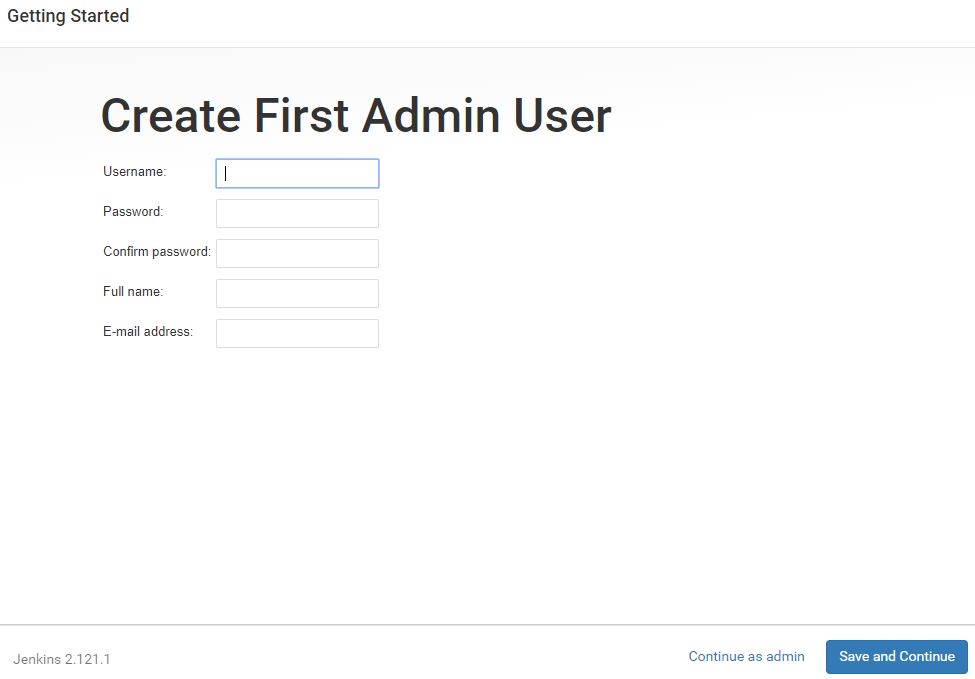

<li>Great! your Jenkins setup is done. And, it is ready.</li>

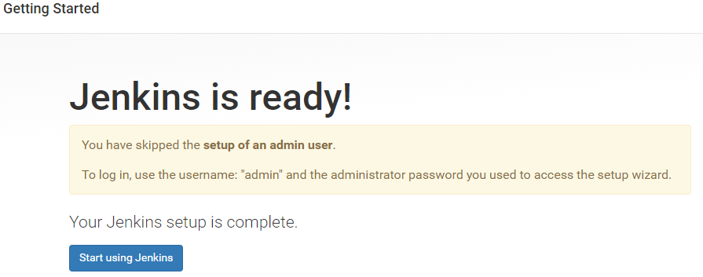

<li>You will find Jenkins dashboard as below:</li>

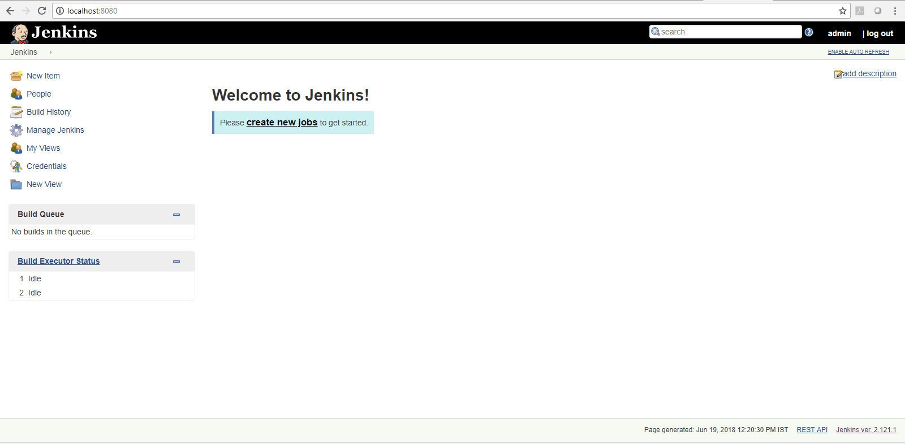

</ul>

After completing the above setup we will see now how to setup JMeter with Jenkins for performing a load test.

 <b>Download and Install Jenkins:</b>

<ul >
<li>We need <a href="https://wiki.jenkins.io/display/JENKINS/Performance+Plugin">Performance Plugin </a> (download the latest release) to get JMeter support.</li>

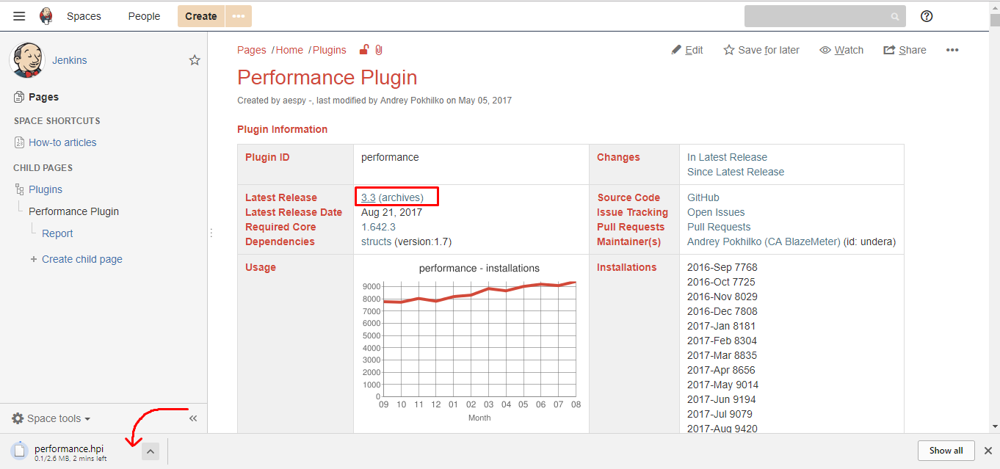

<li>Copy the downloaded performance.hpi file to plugins of <b>.jenkins </b>folder.</li>

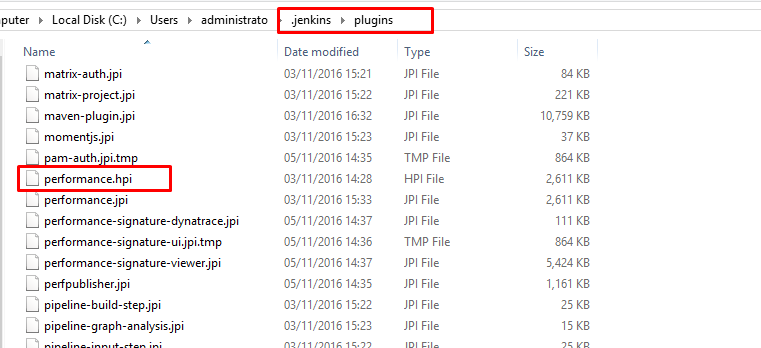

<li>Now Restart the Jenkins to pick up this plugin.</li>
<li>Now you can find <b>Publish Performance Test Result Report </b>option under Jenkins &gt;&gt; <b>Your Project </b>&gt;&gt; <b>Configure </b>&gt;&gt; <b>Add post-build action from dropdown </b>.</li>
<li>As <b>Publish Performance Test Result Report </b> generates the average, median and 90 percentile values along with the errors count of each build. Also it compares the build with the previous builds.</li>
<li>If your latest build inadvertently causes <b>response times </b>to go above an acceptable threshold or SLA, your CI system will automatically raise a <b>'red flag' </b>and mark the build as <b>'failed' </b>. This helps in finding out the cause of the problem.</li>

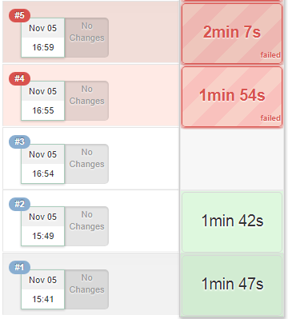

</ul>

 <b>JMeter test with Jenkins: </b>

<ul >
<li>After setting up the entire above configuration, now we will start a JMeter test with Jenkins. We need Non-GUI mode to run test.</li>
<li>Before starting the test go to <b>user.properties </b>and set <b>jmeter.save.saveservice.output_format=xml </b>or you send it through command line arguments as -Jjmeter.save.saveservice.output_format=xml </li>
<li>Now go to your Jenkins dashboard and select <b>New Item </b>and name it accordingly. And select the <b>project type </b> from the below list and click <b>OK </b>.</li>

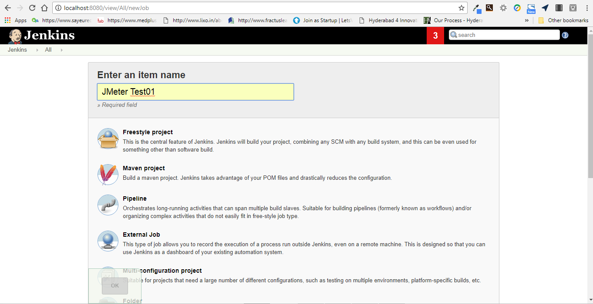

<li>After clicking OK, we can see the configuration page of the build item as below:</li>

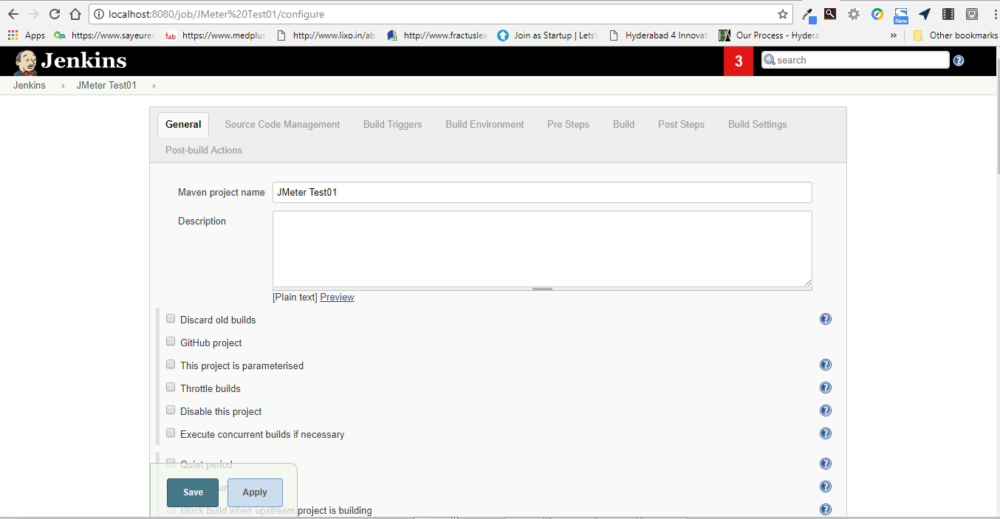

<li>Configure all steps required for your project accordingly and in <b>Post Steps </b>&gt;&gt; <b>Add post-build action;</b> select <b>Execute Windows batch command </b>.</li>
<li>And pass command line arguments as <b> path to apache jmeter - bin\jmeter.bat -Jjmeter.save.saveservice.output_format=xml -n -t SampleTest.jmx -l test1.jtl </b>to start the JMeter test..</li>

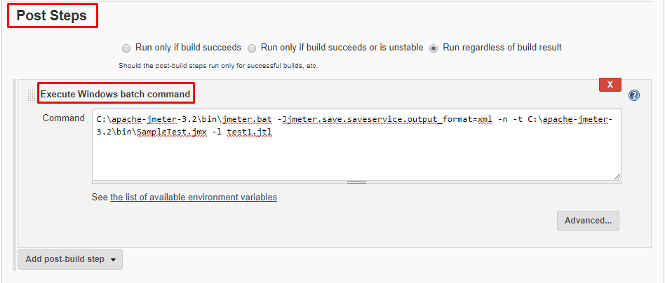

<li>Now we will use the Performance Plugin to get the statistics of the build go to <b>Post-build Actions </b>&gt;&gt; <b>Add post-build action </b>&gt;&gt; <b>Publish Performance test result report </b>and give the .jtl file name and save it. </li>

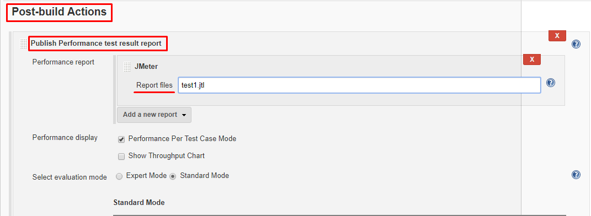

<li>We can find the project has created and select <b>Build Now </b>to start the test. </li>

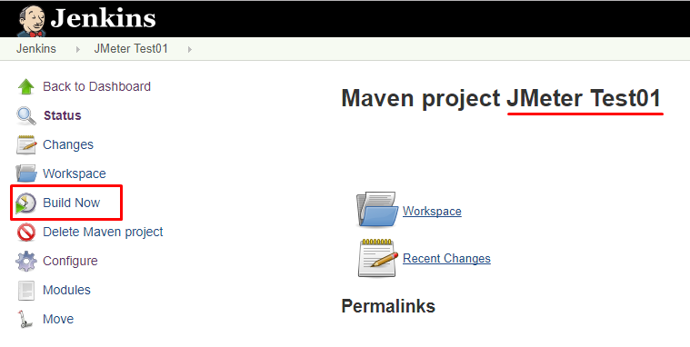

<li>To check the execution of the test go to <b>Console Output </b>of the build you can see the summary report of your JMeter test. And you can find log and .jtl results file under your project.</li>
<li>Also Jenkins allows you to <b>build parameters </b>for your JMeter test by selecting <b>This project is parameterised </b>check box.</li>

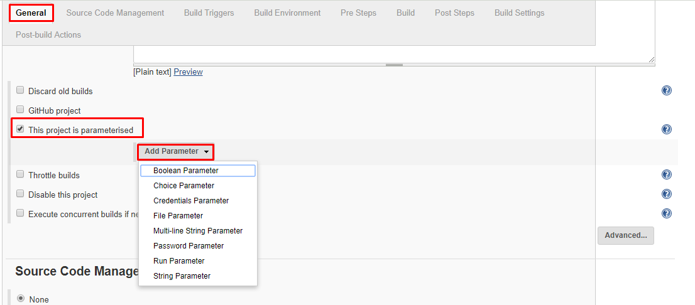

</ul>

Now you have automated the performance testing, you can spend more time on improving your software instead of struggling with identifying performance problems.

