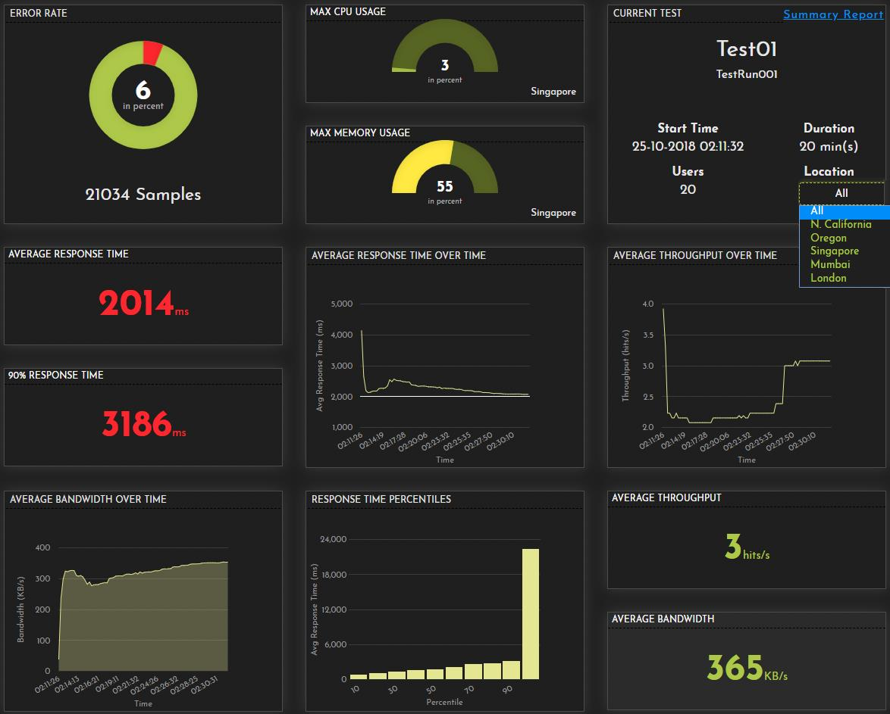
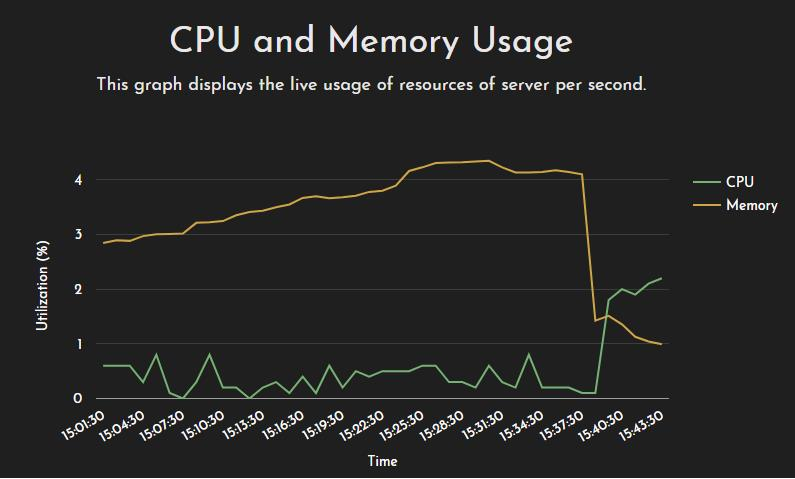

<b>What is Performance Testing?</b>

Performance testing is a general testing practice performed to determine certain system parameters such as responsiveness and stability under various workload.

The primary focus of performance testing is to determine software program's-

<ul class="blog-content">
<li>Speed - Determines how quickly an application responds</li>
<li>Scalability - Determines the maximum user load the software application can handle.</li>
<li>Stability - Determines if the application is steady under varying loads.</li>
</ul>

<b>When should you use Performance Testing?</b> 

When you need to check your website performance and application performance, just as servers, databases, systems, and so on. In the event that you work with the waterfall methodology, at that point in any event each time you release a version, performance testing must be performed. In case you're shifting and going agile, you should do performance testing continuously.

An example from FrugalTesting's performance report is given below:

<b>What is Stress Testing?</b>

Stress testing refers to the testing of software or hardware to decide if its performance is satisfactory under any extreme and unfavorable conditions, which may happen because of substantial system traffic, process loading, or heavy requests for resource usage.. 

Most frameworks are developed under the presumption of typical operating conditions. Therefore, regardless of whether a limit is crossed, errors are irrelevant if the system experiences stress testing during development..

<b>When Should You Use Stress Testing?</b>

Website stress tests and application stress tests are significant before major events, similar to Black Friday, ticket selling for a blockbuster show or the elections. Whichever the scenario is, we recommend you to stress test from time to time so you know your system's endurance abilities. This guarantees you're constantly prepared for unforeseen traffic spikes, and gives you additional time and resources to fix your bottlenecks.

<b>What is Load Testing?</b>

It's a kind of performance testing that simulates real-world load scenario on any software, application, or website. It looks at how the system acts amid normal and high loads and decides whether a system, a piece of software, or computing device can deal with high loads given a maximum demand of end users. This tool is commonly applied when a software development project nears its completion

<b>When Should You Use Load Testing?</b>

A load test can be performed on end to end IT systems or smaller components like database servers or firewalls. It gauges the speed or limit of the system or segment through transaction response time. At the point when the system components significantly expand response times or become unsteady, the system is probably going to have achieved its most extreme operating limit. At the point when this occurs, the bottlenecks ought to be identified and solutions be given.

