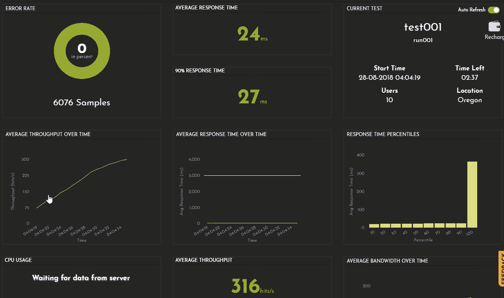

Start your first free load test that is, by entering the URLs / APIs endpoint of your web apps or mobile
apps or uploading your jmx test script without any charges taken for your test. Select the load
configuration settings for your free load testing service:

<ul >
<li>Up to 20 concurrent virtual users</li>
<li>Test Duration up to 10 minutes</li>
<li>One or more geographic locations to generate load from</li>
<li>Simulate network bandwidth as your users may face in real live situations</li>
</ul>

To get better understanding of how your application URLs / APIs perform under expected load conditions, increase the load configuration with more virtual users for more duration and test across multiple geographic locations as well. Load test the APIs and analyze the report with real time analytics and improve your application or APIs load capability performance by 200%.

<h5 class="blog-subtitle">Download deep-dive, in-depth analysis report and optimize from FrugalTest NOW!</h5>

<!--  -->
  

Start your first load test by creating your account <a href="https://www.frugaltesting.com/login"> here </a> and get real time analytics, get free loadtesting service and speed up your web and mobile application performance with <a href="https://www.frugaltesting.com"> FrugalTesting. </a>

