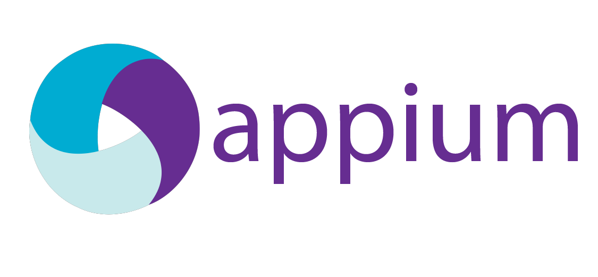
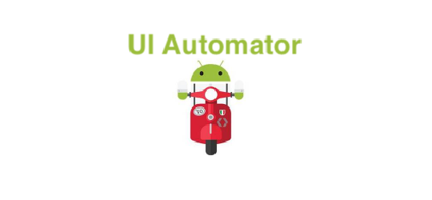

There's no arguing that an automated mobile testing framework is an integral part of the software development cycle. You absolutely need automation testing to deliver quality applications in an orderly fashion, particularly for rapidly changing mobile apps. To exploit the greatest results from your software delivery, your automated tests should be carefully planned and scheduled in such a way that they are cost-effective. For this purpose, the right choice of tools is crucial. It's also a hard choice to make, because navigating through the vast variety of testing tools available for mobile developers nowadays can be very challenging. Tools that are recommended are:

<b>Appium</b> is an open-source mobile application testing tool that supports both iOS and Android. It can be used to test any sort of mobile application: native, web and hybrid. Appium is a cross-platform tool, which means you can run the similar test on various platforms. To accomplish this cross-platform ability, Appium uses vendor provided Android UI framework for testing: XCTest for iOS and UIAutomator or Instrumentation for Android. It wraps these vendor frameworks into Selenium WebDriver. This permits Appium to developers compose tests in a wide assortment of programming languages: Java, Objective-C, JavaScript, PHP, Ruby, Python, and so on. It additionally makes composing the Appium test fundamentally the same as composing Selenium tests.

As WebDriver was initially created for web testing, Appium extended WebDriver with extra API methods to make it more suitable for mobile automation.
 Here are some additional useful Appium features:

<ul >
<li>You don't have to install anything on the device.</li>
<li>You don't have to recompile or change your app in any way to test it with Appium.</li>
<li>Appium has a vast and active community.</li>
<li>Appium comes with a tool which can be used to scan and analyze an application's UI components - Appium UI Inspector. Android Studio's UI Automator Viewer can also be used by the Developers.</li>
</ul>

 Click <a href="http://appium.io/">here</a> for more information on <b>Appium</b>.

<b>Calabash</b> is an open-source mobile testing tool that was created and maintained by Xamarin. It underpins local and hybrid applications on both iOS and Android. The set of activities that can be performed by Calabash testing incorporate gestures, assertions, and screenshots. Calabash is integrated with Cucumber which is a testing tool for Behavior-Driven Development.

Xamarin declared in 2017 that it was finishing active development of Calabash. While you can in any case use Calabash for the present, the choice to stop development makes Calabash a not exactly perfect testing solution.

 Click <a href="https://www.guru99.com/calabash-android-ios-testing.html">here</a> for more information on <b>Calabash</b>.

<b>Espresso</b> is an Android UI Framework from Google. It's a lightweight, white-box testing tool targeted towards application developers. This means to use Espresso to its full potential, the test developer has to be fully familiar with and have access to app code. As a result, Espresso tests are very reliable and they run quickly. Since, Espresso has access to UI object's internals, it can test WebView, i.e. hybrid applications. The tests are written in Java.
 
As far as the drawbacks are concerned, Espresso can test only one application at a time, and doesn't have access to device resources. However, this could be easily solved by creating combined tests with UI Automator.

 Click <a href="https://developer.android.com/training/testing/espresso">here</a> for more information on <b>Espresso</b>.

<b>UI Automator</b> is an Android UI framework for mobile testing developed and maintained by Google. Its key features include cross-application functional testing, the ability to test multiple apps, and switch between installed and system applications. UI Automator is a black-box testing tool (i.e., a test developer doesn't need to know the internal app structure and can rely entirely on visible UI elements). Not surprisingly, UI Automator's tests are written in Java- Google's ultimate language of choice. UI Automator consists of two sets of APIs: UI Automator APIs, to manipulate the UI components of an app, and device state APIs, to access and perform operations on the device. It also comes with a very useful UI Automator Viewer, a GUI tool to scan and analyze the UI components currently displayed on the device. 
The downside of the UI Automator is that it doesn't support WebView, upon which hybrid Android apps are built. Therefore, UI Automator supports only native Android applications.

 Click <a href="https://developer.android.com/training/testing/ui-automator">here</a> for more information on <b>UI Automator</b>.

<b>Robotium</b> is an open source Android UI framework. It has been around since 2010, and today has turned into an extremely experienced and a steady tool. The last version, 5.6.3, was discharged in Sept, 2016. In the last couple of versions, test readability and test execution speed have been essentially improved.

Most specialized online journals, instructional exercises, and courses allude to the sort of testing used by Robotium as black box testing however it can be argued that it is actually a gray box testing. This is on the grounds that to compose Robotium tests, you have to realize the internal application structure.

Robotium is an extention of the Android testing framework and, in that capacity, it uses run-time binding to UI components, which makes tests progressively strong. Robotium comes as a jar file that must be compiled with your project .

Some of the Robotium features are:

<ul >
<li>Supports both native and hybrid applications</li>
<li>Can run tests on real devices and emulators as well.</li>
<li>Supports full Android UI paraphernalia such as activities, buttons, menus, toasts, dialogs, etc.</li>
<li>Supports gestures</li>
<li>Has some device control functions such as change device orientation, take screenshots, unlock screen, etc.</li>
<li>Robotium recorder is available as a paid Android Studio and Eclipse plugin. It's a great tool to get up and run tests quickly.</li>
<li>Can run as part of continuous integration</li>
<li>The language of choice for Robotium is Java.</li>
</ul>

 Click <a href="https://github.com/RobotiumTech/robotium">here</a> for more information on <b>Robotium</b>. 

