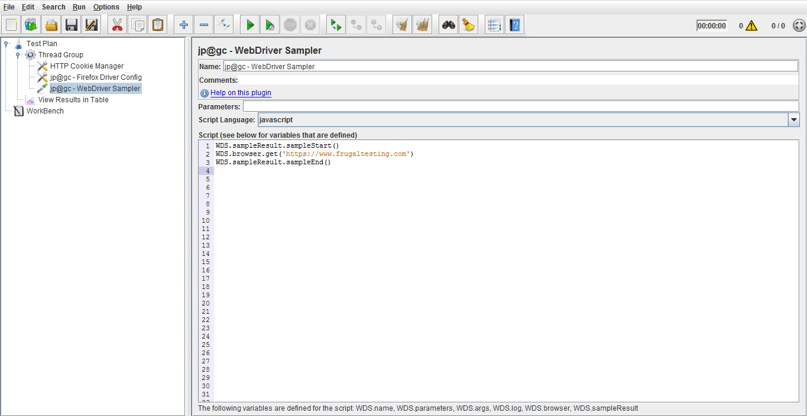
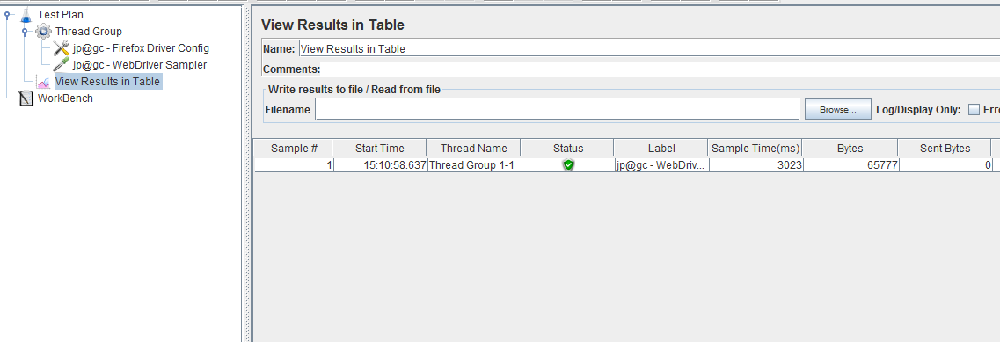

Up to this point, performance testing has been on the server side of things as JMeter does not include the time needed to render the response, nor does JMeter process any client code, for example JavaScript . Things that add to the overall browser execution time may include:

Some of the new and noteworthy changes are.

<ol class="blog-content">
<li><strong>Client-side JavaScript execution</strong> - e.g. AJAX, JS templates</li>
<li><strong>CSS transforms </strong>- e.g. 3D matrix transforms, animations</li>
<li><strong>3rd party plugins</strong> - e.g. youtube, Double click ads, site analytics, etc.</li>
</ol>

Hopefully, JMeter eco-system is very rich, so there is a solution for this; we will use<strong> WebDriver Sampler</strong> in JMeter as this sampler<strong> automates</strong> the execution and collection of performance metrics on <strong>client-side</strong>. 

To get WebDriver Sampler--<a href="https://jmeter-plugins.org/wiki/WebDriverSampler/" target="blank">https://jmeter-plugins.org/wiki/WebDriverSampler/</a>

Also we need to install the browser Driver plugins of JMeter to run the test on the particular browser like<strong> jp@gc - Chrome Driver Config, jp@gc - Firefox Driver Config</strong>, etc

Configuration of WebDriver Sampler test:

<ol>
<li>Add a <strong>Thread Group</strong> to the Test Plan, and add <strong>HTTP Cookie Manager, jp@gc - Firefox Driver Config</strong> (from Config Element), <strong>jp@gc - WebDriver Sampler</strong> (from Sampler) to the Thread Group and a listener <strong>View Results in Table</strong>.</li>
<li>Write/Add the code in the <strong>WebDriver Sampler</strong> which you want to test. Here is the sample code, where it says to open www.frugaltesting.com website and to get load time of it:

<code>
WDS.sampleResult.sampleStart()  WDS.browser.get('https://www.frugaltesting.com') 
WDS.sampleResult.sampleEnd() 
</code>

</li>
<li>Now when we hit play button, JMeter will open a Firefox browser and search<a href="https://www.frugaltesting.com/" target="_blank"> www.frugaltesting.com</a> site and end the test as browser closes automatically after performing the actions according to the script (sample script) in the Web Driver Sampler.</li>
<li>We can see the sample result in the View Result Table.

 

 </li>
</ol>

Configuration of WebDriver Sampler test:

<ol>
<li>The reader should be prudent in the number of threads they will create as each thread will have a single browser instance associated with it. </li>
<li>As each browser consumes a significant amount of resources, so a limit should be placed on how many browsers the user should create.</li>
</ol>

<a href="https://www.frugaltesting.com">FrugalTesting</a> is one stop solution for all your testing challenges. <a href="start-your-first-free-load-test"> Take your first free Load test here!</a>

<a href="introduction-to-apache-jmeter-aquick-guide">Read on to know more about Apache JMeter</a>

